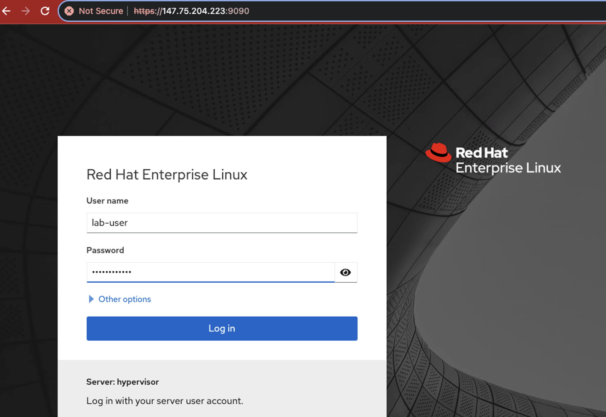
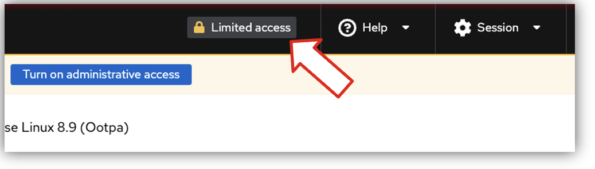
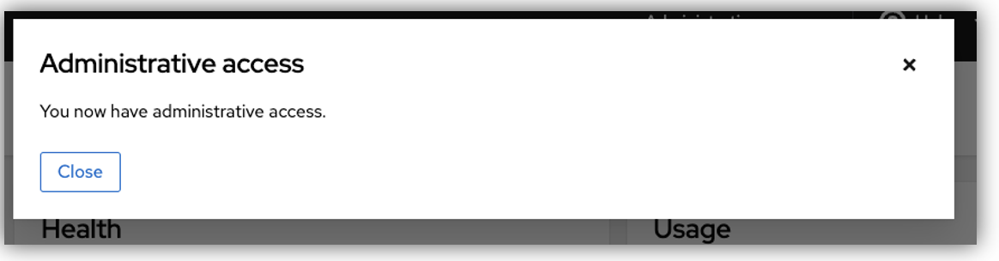
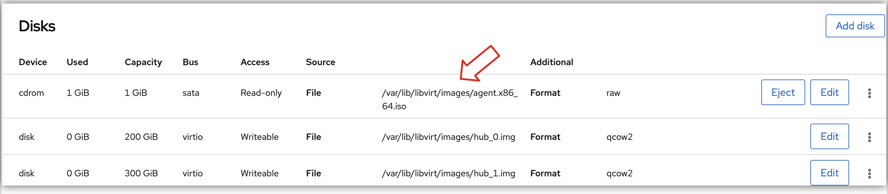
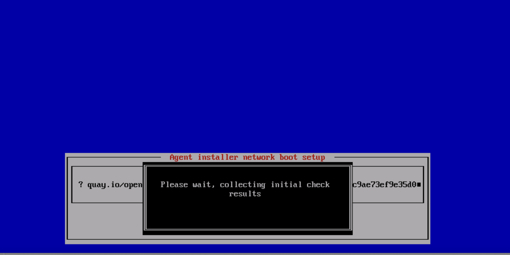
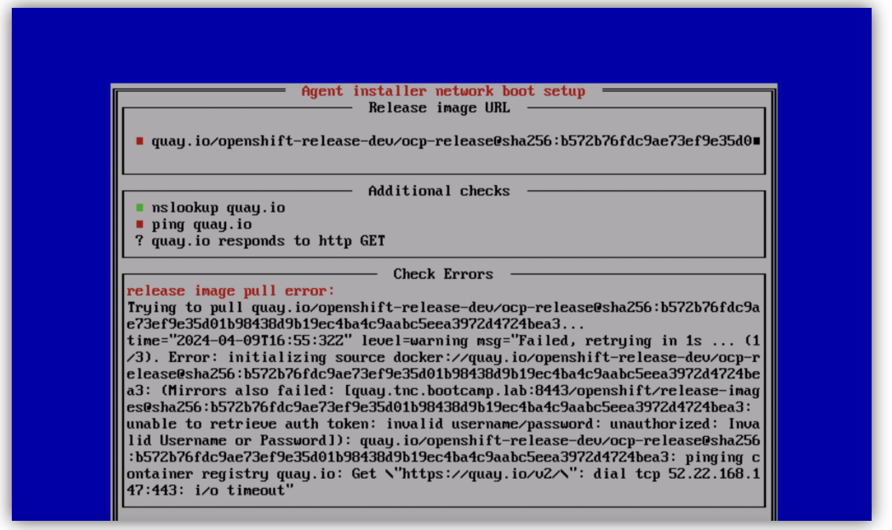

[TOC]

# Installing a Disconnected Cluster using Agent Based Installation method: 

This lab guide uses a bare metal server to demonstrate the deployment of a fully disconnected clsuter using Agent Based Installer (ABI) methodology. 
The lab involves the following steps. 
1. Parepare the host environemnt. This installs the applications needed, and disk partitions for performing the main lab tasks. 
2. Create the networking environment for the environment
3. Create the Vritual Machines to emulate Bastion and Cluster Node(s)
- Installing the mirror-registry 
- Mirroring Openshift image and operators to the local image registry 
- Genering an ISO file and booting the OpenShift Node(s) with the ISO

## Prepare the host server: 
The lab uses m3.large.x86 metal server from Equinix. This can be requested through [RHDP](https://demo.redhat.com/catalog?search=equinix+metal+baremetal+blank)
Use the following to set up the server: 

```
###################
# Step#1: Basic Config, Add-ons and Disk Partitiions:
###################
sudo -i
dnf update -y
# install python and cockpit (for VM console later)
dnf -y install python3.9 cockpit cockpit-machines
systemctl enable --now cockpit.socket
# set python stuff (path needed in RHEL8)
ln -s /bin/pip3 /bin/pip
ln -s /bin/python3.9 /bin/python

parted -s -a optimal /dev/nvme0n1 mklabel gpt mkpart primary 0 3841GB
sleep 20
udevadm settle
parted -s -a optimal /dev/nvme1n1 mklabel gpt mkpart primary 0 3841GB 
sleep 20
udevadm settle
mkfs.xfs /dev/nvme0n1p1
mkfs.xfs /dev/nvme1n1p1
X=`lsblk  /dev/nvme0n1p1 -no UUID`
echo "UUID=$X       /var/lib/containers/storage/   xfs     auto 0       0" >> /etc/fstab
sleep 20
Y=`lsblk  /dev/nvme1n1p1 -no UUID`
echo "UUID=$Y       /var/lib/libvirt   xfs     auto 0       0" >> /etc/fstab
mkdir -p /var/lib/containers/storage/
mkdir -p /var/lib/libvirt/
systemctl daemon-reload
mount -av
restorecon -rF /var/lib/containers/storage/
restorecon -rF /var/lib/libvirt/
sleep 20
########### set up SSH:
ssh-keygen -t rsa -b 4096 -N '' -f ~/.ssh/id_rsa
sleep 10
###################
# Step#2: Enable Virtualization:
###################
# enable virtualization: 
dnf -y install libvirt libvirt-daemon-driver-qemu qemu-kvm
usermod -aG qemu,libvirt $(id -un)
newgrp libvirt
systemctl enable libvirtd --now
sleep 10
# verify: systemctl status libvirtd. Output should show that its active. 
systemctl is-active libvirtd # should show active
sleep 10
#
###################
# Step#3: Install KCLI Tool to manage virtual environment
###################
dnf -y copr enable karmab/kcli
dnf -y install kcli bash-completion vim jq tar git ipcalc python3-pip
#
###################
# Step#4: Install other tools:
###################
dnf -y install podman httpd-tools runc wget nmstate containernetworking-plugins bind-utils bash-completion tree
#
###################
# Step#5: Disable Firewall:
###################
systemctl disable firewalld iptables
systemctl stop firewalld iptables
iptables -F
sleep 30
systemctl restart libvirtd
```

### Installing Ksushy for Redfish API usage: 

The basic tools are installed at this point. Next we will install the Ksushy tool, as it allows use of Redfish APIs to manage the state of the VMs. This will primarily be used to mount the bootable media using Redfish API calls later. 

```
###################
# Step#6: Enable KShushy, to use Redfish API for VM management:
###################
pip3 install cherrypy 
pip install -U pip setuptools 
pip install pyopenssl
kcli create sushy-service --ssl --port 9000 
systemctl enable ksushy --now
sleep 10
systemctl is-active ksushy
```
## Creating Networking:

### Creating Virtual Network Bridges: 
The virual environment will comprise a virtual machine that will act as our jumphost server (or Bastion, as its commonly called), and one or more VMs that will be used to install the OpenShift Cluster. 

The VM(s) for OpenShift cluster have to be fully disconencted from the internet. Hence they will require their own network. In a real world, that may ba L2/L3 VPN (typically L2 vpn, as its same subnet). In the lab, we will emulate this by creating a virtal bridge called `tnc` 

The Bastion VM will also need connectivity to this L2 bridge, to be able to communicate with the server, make API calls etc. But the Bastion server will also need access to the internet to be able to download installation images etc. So it will connect to `tnc` bridge, as well as another bridge called `tnc-connected` that can reach internet by using NAT. 

```
###################
# Step#7: Create Local Net:
###################
# Need to do this before restarting NetworkManager, or else DNS fails as there isn't any 192.168.125.1 existing
# create cluster:
kcli create pool -p /var/lib/libvirt/images default
kcli create network -c 192.168.125.0/24 -P forward_mode=route -P dhcp=false --domain tnc.bootcamp.lab tnc
kcli create network -c 192.168.126.0/24 -P dhcp=false --domain tnc.bootcamp.lab tnc-connected
```

### Creating DNS Service: 

DNS service is a pre-requisite for cluster deployment and usage. The service can run anywhere that is reachable by the cluster (as well as by Bastion). The best place to set up this service in the lab environment is on the host operating system. This is done using the following: 

```
###################
# Step#8: DNS:
###################
dnf install dnsmasq

cat << EOF > /etc/NetworkManager/conf.d/dnsmasq.conf
[main]
dns=dnsmasq
[connection]
ipv4.dns-priority=200
ipv6.dns-priority=200
EOF

cat << EOF > /etc/NetworkManager/dnsmasq.d/main.conf
# listen-address=192.168.125.1
server=8.8.8.8
domain=tnc.bootcamp.lab
EOF

cat << EOF > /etc/NetworkManager/dnsmasq.d/hub.conf
address=/api.hub.tnc.bootcamp.lab/192.168.125.100
address=/api-int.hub.tnc.bootcamp.lab/192.168.125.100
address=/.apps.hub.tnc.bootcamp.lab/192.168.125.100
address=/quay.tnc.bootcamp.lab/192.168.125.1
EOF

systemctl reload NetworkManager.service
systemctl restart NetworkManager.service
# Check if service is active: 
systemctl is-active NetworkManager
```

Note that the DNS records for the "hub" SNO cluster have been created as well. 

### Install Openshift Client:

Even though we will primarily use Bastion for making API calls and run OC commands, it doesn't hurt to install this tool on the host as well. This is optional:

```
###################
# Step#9: Install OC Client 
###################
wget https://mirror.openshift.com/pub/openshift-v4/x86_64/clients/ocp/4.14.18/openshift-client-linux-4.14.18.tar.gz
tar -xvf openshift-client-linux-4.14.18.tar.gz 
mv oc /usr/bin/
rm -f openshift-client-linux-4.14.18.tar.gz 
oc completion bash > oc.bash_completion
mv oc.bash_completion /etc/bash_completion.d/
```

## Create and configure needed VMs: 

### Configure and Bringup Bastion VM:

```
###################
# Step#10: Configure, and Bring up VM for mirroring
###################
cat << EOF > bastion.yaml
bastion:
 pool: default
 rootpassword: redhat
 image: centos9stream
 numcpus: 6
 memory: 16000
 files:
 - path: /etc/motd
   content: Welcome to the cruel world
 nets:
 - name: tnc
   nic: eth0
   ip: 192.168.125.10
   mask: 255.255.255.0
   # gateway: 192.168.125.1
 - name: tnc-connected
   nic: eth1
   ip: 192.168.126.10
   mask: 255.255.255.0
   gateway: 192.168.126.1
 cmds:
 - echo "PermitRootLogin yes" >> /etc/ssh/sshd_config
 - ssh-keygen -t rsa -b 4096 -N '' -f ~/.ssh/id_rsa
 - systemctl restart sshd
 - dnf install -y podman bind-utils nmstate httpd
EOF
```

Start the VM:

```
kcli create plan -f bastion.yaml
```

Verify if the VM has been created and is up:

```
kcli list vm
+---------+--------+----------------+---------------+----------------+---------+
|   Name  | Status |       Ip       |     Source    |      Plan      | Profile |
+---------+--------+----------------+---------------+----------------+---------+
| bastion |   up   | 192.168.125.10 | centos9stream | romantic-goiko |  kvirt  |
+---------+--------+----------------+---------------+----------------+---------+
```

### Configure Password-less SSH for Bastion access:
```
ssh-copy-id root@192.168.126.10 -f
```
Also make the `id_rsa` file to tbe the primary key used: 
```
echo "IdentityFile /root/.ssh/id_rsa" >> ~/.ssh/config
```
### Create VM for SNO Cluster: 

```
cat << EOF > ~/hub.yaml
hub:
 pool: default
 uefi: true
 start: false
 numcpus: 16
 memory: 48000
 disks:
 - size: 200
 - size: 300
 nets:
 - name: tnc
   nic: eth0
   mac: 52:54:00:35:bb:80
   ip: 192.168.125.100
   mask: 255.255.255.0
   gateway: 192.168.125.1
EOF
kcli create plan -f hub.yaml
```

## Creating the Mirror registry:

The mirror registry can be any Any Docker v2.2 compliant registry. Some examples include Red Hat Quay, JFrog Artifactory, Harbor etc. More information can be found [here](https://docs.openshift.com/container-platform/4.14/installing/disconnected_install/installing-mirroring-installation-images.html#installation-about-mirror-registry_installing-mirroring-installation-images). 

**Note** OpenShift's built-in image registry can't be used for this purpose due to its limition of not being able to not being able to push images without tag

We will use the Red Hat Quay as mirror registry. The installation of this involves the following requirements:
* configuring a pull secret. This is needed to pull the registry images from Red Hat. We will take care of this in upcoming section
* 2 or more vCPU & 8GB of RAM. 
* FQDN already defined for the Quay registry. This was taken care of by the earlier step where DNS was configured. 
* About 12GB for the OCP 14 images. If including all operators, this may require upto 358GB. This is taken care by allocating a large disk partition to `/var/lib/containers/storage/` in the initial configurations we did. 

More details about the requirements and other steps can be found [here](https://docs.openshift.com/container-platform/4.14/installing/disconnected_install/installing-mirroring-creating-registry.html)

### Pull Secret:

For this step, you will need a pull secret from Red Hat. You can download your pull secret [here](https://console.redhat.com/openshift/downloads) (scroll all the way down to the "Token" section)
```
export PULL_SECRET='<<paste your pull secret here>>'
```
**NOTE** use single quotes here, as pull secret may contain fileds with double-quotes. 

```
###################
# Step#11_a: Mirroring - Add Pull Secret
###################
mkdir ~/.docker
echo $PULL_SECRET > ~/.docker/config.json
```
### Install the Mirror Registry: 

First, download the installer using the following: 

```
wget https://github.com/quay/mirror-registry/releases/download/v1.3.10/mirror-registry-online.tar.gz
tar -xvf mirror-registry-online.tar.gz
chmod u+x mirror-registry
```
Run the installer: 

```
###################
# Step#11_b: Installing Mirror Registry
###################
~/mirror-registry install --quayHostname quay.tnc.bootcamp.lab --quayRoot /opt/ --initUser quay --initPassword syed@redhat
```

The insaller shall create a few pods for the mirror registry, and end with the following lines: 

```
INFO[2024-04-05 13:06:26] Quay installed successfully, config data is stored in /opt/
INFO[2024-04-05 13:06:26] Quay is available at https://quay.tnc.bootcamp.lab:8443 with credentials (quay, syed@redhat)
```

To furhter verify if the installation is successful, check the pods it must have created: 
```
podman ps
CONTAINER ID  IMAGE                                                    COMMAND         CREATED         STATUS         PORTS                   NAMES
6da068577f02  registry.access.redhat.com/ubi8/pause:8.7-6              infinity        12 minutes ago  Up 12 minutes  0.0.0.0:8443->8443/tcp  2ee3e8b0d965-infra
321acd27dc91  registry.redhat.io/rhel8/postgresql-10:1-203.1669834630  run-postgresql  12 minutes ago  Up 12 minutes  0.0.0.0:8443->8443/tcp  quay-postgres
6494e91da547  registry.redhat.io/rhel8/redis-6:1-92.1669834635         run-redis       11 minutes ago  Up 11 minutes  0.0.0.0:8443->8443/tcp  quay-redis
2ab76abfdb27  registry.redhat.io/quay/quay-rhel8:v3.8.14               registry        11 minutes ago  Up 11 minutes  0.0.0.0:8443->8443/tcp  quay-app
```
### Add Registry Credentials:

To add the newly deployed registry credentials in your locally saved pull secret (by default, its `~/.docker/config.json`), use the following: 
```
###################
# Step#11_c: Adding Mirror Registry Secret
###################
podman login https://quay.tnc.bootcamp.lab:8443 --tls-verify=false --authfile .docker/config.json -u quay -p syed@redhat
```

This will result in: 
> Login Succeeded!

## Preparing the Bastion VM:

The Bastion VM was already brought up. To make it useful, few tools will need to be installed on it. 

### Copying pull secret & Quay cert to Bastion VM:

```
###################
# Step#12_a: Adding Pull Secret & Quay Cert to Bastion
###################
scp .docker/config.json root@192.168.126.10:~/
scp /opt/quay-rootCA/rootCA.pem root@192.168.126.10:~/
```
The rest of the configuration will be done from inside the VM. You can connect to it using the following: 
```
virsh console bastion
```
The credentials to use are `root` and `redhat` 

### Installing OpenShift Client, Installer  and Mirror Plugin

To perform the mirroring to the registry, the `oc mirror` command will be used. This requires installation of `openshift client` as well as `mirroring pluging` for the openshift client. 
Additionally, to build the ISO image for Agent Based Installer, the `openshift-install` binary is needed. 

The following steps install all three of these items. Before doing that, 

Now lets install the tools:

```
###################
# Step#12_b: Installing OpenShift Client, Installer  and Mirror Plugin
###################
curl https://mirror.openshift.com/pub/openshift-v4/x86_64/clients/ocp/4.14.18/openshift-client-linux-4.14.18.tar.gz -o openshift-client-linux-4.14.18.tar.gz
tar -xvf openshift-client-linux-4.14.18.tar.gz
mv oc /usr/bin/
rm -f openshift-client-linux-4.14.18.tar.gz
oc completion bash > oc.bash_completion
mv oc.bash_completion /etc/bash_completion.d/
#
curl https://mirror.openshift.com/pub/openshift-v4/x86_64/clients/ocp/4.14.18/oc-mirror.tar.gz -o oc-mirror.tar.gz
tar -xvf oc-mirror.tar.gz
chmod u+x oc-mirror
#
curl https://mirror.openshift.com/pub/openshift-v4/x86_64/clients/ocp/4.14.18/openshift-install-linux-4.14.18.tar.gz -o openshift-install-linux-4.14.18.tar.gz
tar -xvf ./openshift-install-linux-4.14.18.tar.gz
rm -f openshift-install-linux-4.14.18.tar.gz
mv openshift-install /usr/bin/
#
mv oc-mirror /usr/bin
mkdir ~/.docker
mv config.json ~/.docker/
# 
###################
# Step#12_c: Installing other tools
###################
dnf install -y bash-completion tree
```
## Performing the Mirroring:

For the mirroring process, we will need to first identify which images we want to mirror to the registry. This is done using `imageSetConfiguration`.  Use the following snippet to create this manifest, in which only 4.14.18 images are being identified, in addition to the apprprpriate versions of the operators we will need: 

```
cat <<EOF > imageset-config.yaml
kind: ImageSetConfiguration
apiVersion: mirror.openshift.io/v1alpha2
storageConfig:
  registry:
    imageURL: quay.tnc.bootcamp.lab:8443/ocp/oc-mirror-metadata
    skipTLS: true
mirror:
  platform:
    channels:
    - name: stable-4.14
      type: ocp
      minVersion: 4.14.18
      maxVersion: 4.14.18
  operators:
  - catalog: registry.redhat.io/redhat/redhat-operator-index:v4.14
    packages:
    - name: multicluster-engine
      channels:
      - name: stable-2.5
      - name: stable-2.4
    - name: cluster-logging
      channels:
      - name: stable-5.9
    - name: advanced-cluster-management
      channels:
      - name: release-2.10
      - name: release-2.9
    - name: local-storage-operator
      channels:
      - name: stable
    - name: topology-aware-lifecycle-manager
      channels:
      - name: stable
    - name: quay-operator
      channels:
      - name: stable-3.11
    - name: openshift-gitops-operator
      channels:
      - name: latest
  additionalImages:
  - name: registry.redhat.io/ubi8/ubi:latest
  helm: {}
EOF
```

Note that the `default` channel of the operators always need to be included. In the above manifest, we have ensured to always include the default (also happens to be latest in the current case, but doesn't have to be). This is true at the time of creating these instructions, but may change over time. To find out the available channel versions and default channel version, the following snippet would be handy: 

```
for X in {"cluster-logging","advanced-cluster-management","local-storage-operator","topology-aware-lifecycle-manager","quay-operator","openshift-gitops-operator"}; do oc mirror list operators --catalog=registry.redhat.io/redhat/redhat-operator-index:v4.14 --package=$X; done
```

### Mirroring:
Now the stage is set to start the mirroring process. Use the following command to start that: 
```
oc mirror --config=./imageset-config.yaml docker://quay.tnc.bootcamp.lab:8443 --dest-skip-tls=true --source-skip-tls=true
```

The output will look like the following: 
```
Logging to .oc-mirror.log
Checking push permissions for quay.tnc.bootcamp.lab:8443
Creating directory: oc-mirror-workspace/src/publish
Creating directory: oc-mirror-workspace/src/v2
Creating directory: oc-mirror-workspace/src/charts
Creating directory: oc-mirror-workspace/src/release-signatures
No metadata detected, creating new workspace
wrote mirroring manifests to oc-mirror-workspace/operators.1712338271/manifests-redhat-operator-index

To upload local images to a registry, run:

        oc adm catalog mirror file://redhat/redhat-operator-index:v4.14 REGISTRY/REPOSITORY
<<SNIP>>
info: Mirroring completed in 7m23.91s (163.7MB/s)
Rendering catalog image "quay.tnc.bootcamp.lab:8443/redhat/redhat-operator-index:v4.14" with file-based catalog 
Writing image mapping to oc-mirror-workspace/results-1712941216/mapping.txt
Writing CatalogSource manifests to oc-mirror-workspace/results-1712941216
Writing ICSP manifests to oc-mirror-workspace/results-1712941216
[root@bastion ~]#

```

**NOTE** Takes almost ~15 mins (not 7). If it fails, re-run

In case the script ends with something like:
> error: one or more errors occurred while uploading images

Then just rerun the command one more time. This tends to happen in the virtual environment with virtual linux bridges. Re-run will download the items that couldn't be downloaded in previous attempt. 


<!--  --> 
## Disconnected Environment: 

At this point all the tasks that require internet access for Bastion node are completed. We can go ahead and disconect it completely from the internet, using the following: 

```
nmcli con down "System eth1"
sleep 10
ip route add default via 192.168.125.1 
sed -i 's/^nameserver 192.168.126.1/nameserver 192.168.125.1/g' /etc/resolv.conf
```


Check to ensure that DNS can still be reached: 
```
nslookup quay.tnc.bootcamp.lab
Server:         192.168.125.1
Address:        192.168.125.1#53

Name:   quay.tnc.bootcamp.lab
Address: 192.168.125.1
```

Verify ability to login to Quay:
```
podman login https://quay.tnc.bootcamp.lab:8443 --tls-verify=false
```
Should show: 
> Authenticating with existing credentials for quay.tnc.bootcamp.lab:8443 <br>
> Existing credentials are valid. Already logged in to quay.tnc.bootcamp.lab:8443


<!-- OLD DATA. DISCARD? 
however, lets temporarily disconenct the Bastion VM from the `tnc` bridge, to ensrue that there aren't any routing issues created due to its dual connectivity. Use the following commands: 
```
nmcli con down "System eth0"
sleep 5
sed -i 's/^nameserver 192.168.125.1/#nameserver 192.168.125.1/g' /etc/resolv.conf
```
-->

## Creating the Agent Installer manifests: 

There are two manifests required by Agent Instaler. Those will be created now. 

### Creating Install-Config:

```
cat << EOF > install-config.yaml
apiVersion: v1
baseDomain: tnc.bootcamp.lab
compute:
- architecture: amd64
  hyperthreading: Enabled
  name: worker
  replicas: 0
controlPlane:
  architecture: amd64
  hyperthreading: Enabled
  name: master
  replicas: 1
metadata:
  creationTimestamp: null
  name: hub
networking:
  clusterNetwork:
  - cidr: 10.128.0.0/14
    hostPrefix: 23
  machineNetwork:
  - cidr: 192.168.125.0/24
  networkType: OVNKubernetes
  serviceNetwork:
  - 172.30.0.0/16
platform:
  none: {}
pullSecret: '{"auths":{"quay.tnc.bootcamp.lab:8443":{"auth":"cXVheTpzeWVkQHJlZGhhdA=="}}}'
sshKey: |
EOF
```

Note that the pull secret here is for the locally created mirror registry. We don't need the pull secret to reach redhat.com any more. 

Add the ssh key to be able to access the deployed clsuter node (if needed at some point for debugging):

```
echo -n "  " >> install-config.yaml
cat ~/.ssh/id_rsa.pub >> install-config.yaml
```

Since this is a disconnected environment, the public urls need to be `mapped` to the local registry. This is done through use of `imageContentSourcePolicy`. The manifest for this was already created by the `oc mirror` commmand, and saved in the `~/oc-mirror-workspace/results-X` directory (X is an encoded number). Since our cluster is not yet deployed, we can't apply this manifest to it (the information will be needed at the time of deployment). So this information is plugged into the `install-config.yaml` instead. The following will extract the information from the yaml manifest and save it to a local file called `mirror` :

```
cat ~/oc-mirror-workspace/$(ls ~/oc-mirror-workspace/ | grep result)/imageContentSourcePolicy.yaml | grep -A2 mirrors: | grep -v "\-\-" | sed 's/^  //g' > mirrors
```

You can inspect this file to understand the information bettter. Now lets go ahead and push this information into the `install-config.yaml` file: 

```
echo "imageContentSources:" >> install-config.yaml
cat mirrors >> install-config.yaml
```

Another thing needed to access the local registry is the certificate for accessing Quay. This was created at the time when Quay was deployed, and saved on the host device's `/opt/quay/` directory. In a previous step, we had copied over that file to the home directory of the VM, so now all thats needed is to plug that information into the install-config.yaml: 

```
echo "additionalTrustBundle: |" >> install-config.yaml
cat ~/rootCA.pem | sed 's/^/  /g' >> install-config.yaml
```

### Creating Agent-Config manifest:

The second manifest needed by the installer is `agent-config.yaml`. It will be created using the following: 

```
cat << EOF > agent-config.yaml
apiVersion: v1alpha1
metadata:
  name: hub
rendezvousIP: 192.168.125.100
hosts:
  - hostname: sno
    interfaces:
     - name: eth0
       macAddress: 52:54:00:35:bb:80
    networkConfig:
      interfaces:
      - name: eth0
        state: up
        ipv4:
          address:
          - ip: 192.168.125.100
            prefix-length: 24
          enabled: true
          dhcp: false
      dns-resolver:
        config:
          server:
            - 192.168.125.1
      routes:
        config:
          - destination: 0.0.0.0/0
            next-hop-address: 192.168.125.1
            table-id: 254
            next-hop-interface: eth0
EOF
```
## Creating & Mounting the ISO file:

All the pieces are ready to start the building of ISO file. Use the following command for that: 

**NOTE** This process removes the two manifests we created earlier. IF those have to be preserved for future observation, make a copy of those at some other location. 

```
mkdir ~/abi 
cp install-config.yaml ~/abi/
cp agent-config.yaml ~/abi/
cd ~/abi
openshift-install agent create image --dir=./ --log-level=debug
```

The logs will end with the following: 
```
DEBUG   Reusing previously-fetched ClusterDeployment Config
DEBUG Generating Kubeconfig Admin Client...
DEBUG Fetching Kubeadmin Password...
DEBUG Reusing previously-fetched Kubeadmin Password
```
An ISO would now have been created. We can go ahead and copy that to the default home directory for the HTTP server, and also enable the HTTP server to start listening on the default http port: 

```
cp agent.x86_64.iso /var/www/html/
systemctl enable httpd --now
sleep 10
systemctl is-active httpd
# should show "active"
```
<!-- FOLLOWING IS NO LONGER NEEDED NOW THAT ISSUE IS FIXED...BUT KEEPING FOR HISTORY

Before proceeding, lets disconnect Basation completeion, so there is no chance that any data is being sourced from internet: 
```
nmcli con down "System eth1"
sleep 10
ip route add default via 192.168.125.1 
sed -i 's/^nameserver 192.168.126.1/nameserver 192.168.125.1/g' /etc/resolv.conf
```

-->

You can now go ahead and mount this ISO the the VM (called `hub`) that was created in an earlier step: 

```
curl -d '{"Image":"http:/192.168.125.10/agent.x86_64.iso","Inserted": true}' -H "Content-Type: application/json" -X POST -k https://192.168.125.1:9000/redfish/v1/Managers/local/hub/VirtualMedia/Cd/Actions/VirtualMedia.InsertMedia
```

This command calls the sushy api (installed during host buildup, and listening on port 9000). 

To verify that the mounting was successful, exit the VM, and verify by running the following command on the host machine: 

```
[root@hypervisor ~]# virsh dumpxml hub | grep source
      <source file='/var/lib/libvirt/images/hub_0.img'/>
      <source file='/var/lib/libvirt/images/hub_1.img'/>
      <source file='/var/lib/libvirt/images/agent.x86_64.iso'/>
      <source network='tnc'/>
[root@hypervisor ~]#
```

This command shows the availble boot sources for the vm called `hub`. As you can see, the ISO file is listed amount those sources. Its not the first source, but since the other sources don't contain any boot image, its safe to leave the boot operation as-is. (in a production deployment, the boot sequence should be changed to avoid any confusion due to some preexisting image on the local disks)

## Start & Monitor the installation: 

As soon as the hub VM boots from the mounted ISO file, it will start the Agent Based Installation Process. To achieve that, and being able to monitor the console, we will use graphical console available through Cockpit. 

Cockpit was already enabled in the earlier steps. Lets now connect to it by pointing your browser to the IP address of the Host on port 9090. Login using the user credentials provided for the host. 



By default, the login screen has restricted view. To change that, click on the "Limited Access" button on the top, as shown here: 



This will enable the Administrative access view, as shown here: 



On this view, select "Virtual Machines" from the left hand side menue. This will show you the configured VMs. 


Select "hub"
On the next screen, you can re-verify if the ISO is properly mounted as can be seen here: 



Lets go ahead and. press "RUN"


The node will now go through RHCOS Boot stages. A visual of that is shown here: 


Next, it will perform connectivity checks. This may take a little while: 



If this passes, then the console will proceed to the next screen that gives yuu the opportunity to interrupt and modify netweorking configuration: 


In case the connectivity check etc. don't go well, you will see the failure reported. An example of such a failure is included here: 



If there isn't any error, then you will soon see a login prompt for the cluster, like the one here: 


Cluster is not yet deployed. Its still in progres, and will take some time to complete. 


# TODO:
- show oc get nodes 
- Check status of ICSP and CS ...add operators

### Monitor the Installation using CLI:

You can continue to monitor using console, or you can choose to monitor the pogress using command line using the following commnad (from inside the Bastion VM) to monitor progress:

```
openshift-install agent wait-for install-complete --log-level=debug --dir=/root/abi/
```
The output will end with the following:
```
DEBUG asset directory: /root/abi/                  
DEBUG Loading Agent Config...                      
DEBUG Using Agent Config loaded from state file    
DEBUG Loading Agent Manifests...                   
DEBUG   Loading Agent PullSecret...                
DEBUG     Loading Install Config...  
<<SNIP>>
DEBUG RendezvousIP from the AgentConfig 192.168.125.100 
INFO Bootstrap Kube API Initialized               
INFO Bootstrap configMap status is complete       
INFO cluster bootstrap is complete                
DEBUG Still waiting for the cluster to initialize: Working towards 4.14.18: 562 of 860 done (65% complete) 
DEBUG Still waiting for the cluster to initialize: Working towards 4.14.18: 69 of 860 done (8% complete) 
DEBUG Still waiting for the cluster to initialize: Working towards 4.14.18: 364 of 860 done (42% complete) 
DEBUG Still waiting for the cluster to initialize: Working towards 4.14.18: 74 of 860 done (8% complete) 
DEBUG Still waiting for the cluster to initialize: Working towards 4.14.18: 599 of 860 done (69% complete)
<<SNIP>>
DEBUG Still waiting for the cluster to initialize: Cluster operator openshift-samples is not available 
INFO Cluster is installed                         
INFO Install complete!                            
INFO To access the cluster as the system:admin user when using 'oc', run 
INFO     export KUBECONFIG=/root/abi/auth/kubeconfig 
INFO Access the OpenShift web-console here: https://console-openshift-console.apps.hub.tnc.bootcamp.lab 
INFO Login to the console with user: "kubeadmin", and password: "agwwb-DjcFP-WV6Xo-G29Fm" 
```

Your disconnected cluster is now up and running! 

Note that the very last lines in the log indicate the KUBECONFIG path, as well as `kubeadmin` credentials. 

## Acessing the cluster: 

```
mkdir ~/.kube
cp ~/abi/auth/kubeconfig ~/.kube/config
```

```
oc get nodes
NAME   STATUS   ROLES                         AGE   VERSION
sno    Ready    control-plane,master,worker   17m   v1.27.11+749fe1d
oc get clusterversion
NAME      VERSION   AVAILABLE   PROGRESSING   SINCE   STATUS
version   4.14.18   True        False         4m8s    Cluster version is 4.14.18
```

<!--
## Some other useful snippets for later use: 
```
grub:
console=tty0 console=ttyS0
OR
console=ttyS0,115200 console=tty0
virsh dumpxml hubvm | grep source


virsh start --console hubvm

curl -X PATCH -H 'Content-Type: application/json' -d '{
      "Boot": {
          "BootSourceOverrideTarget": "Cd",
          "BootSourceOverrideMode": "Uefi",
          "BootSourceOverrideEnabled": "Continuous"
      }
    }' -k https://127.0.0.1:9000/redfish/v1/Systems/local/abinode


~             
```
-->
