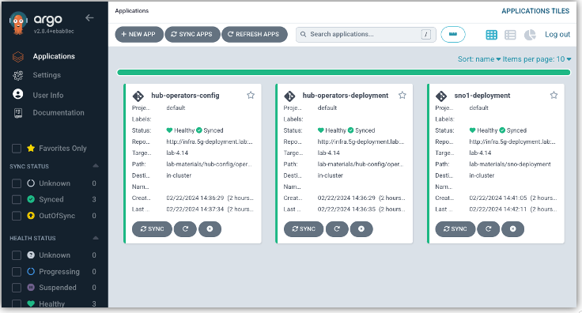
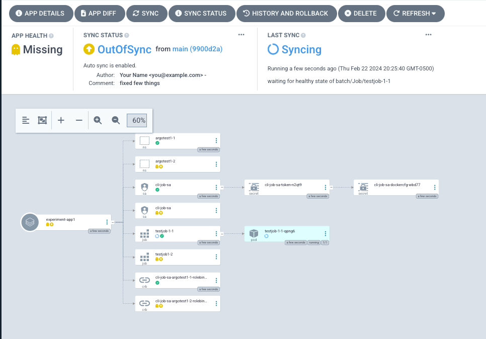
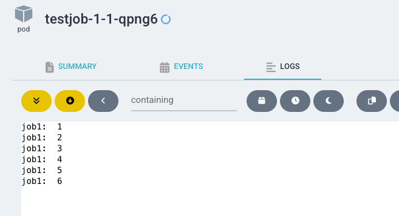
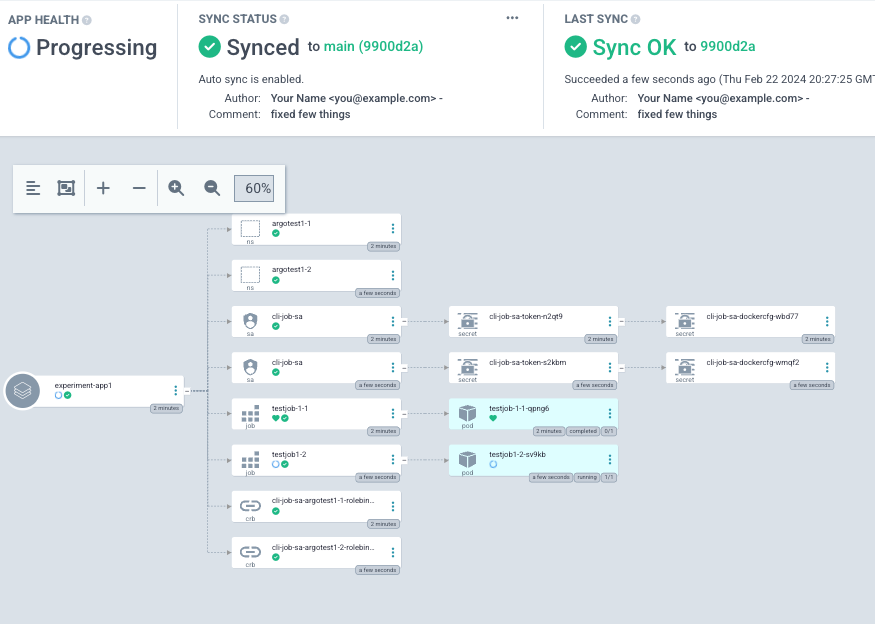
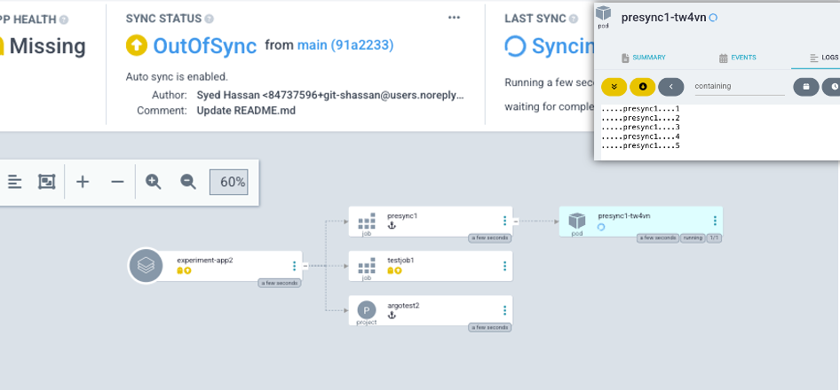
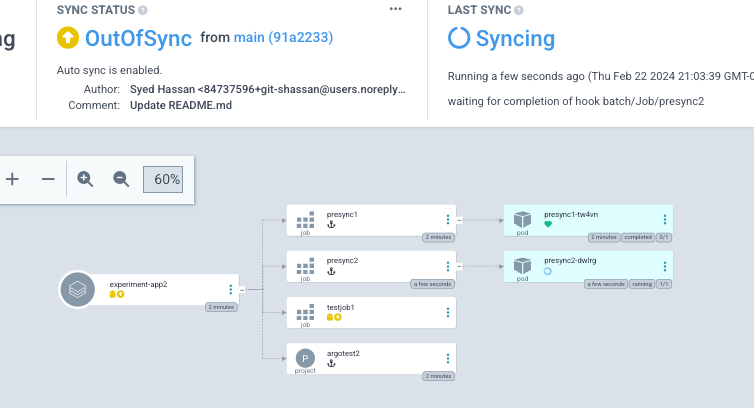

# OpenShift GitOps Lab

Purpose: Understand and Use OpenShift GitOps Operator (ArgoCD)

## Install the GitOps Operator: 

```
cat << EOF | oc apply -f - 
apiVersion: operators.coreos.com/v1alpha1
kind: Subscription
metadata:
  name: openshift-gitops-operator
  namespace: openshift-operators
spec:
  channel: latest 
  installPlanApproval: Automatic
  name: openshift-gitops-operator 
  source: redhat-operators
  sourceNamespace: openshift-marketplace 
EOF
```
By default, the operator installs in the `openshift-gitops` namespace,and uses the service-account `openshift-gitops-argocd-application-controller`. This service account has limited privilages on the cluster. Since we want to create various resources with the objective of understanding the GitOps applications and how they work, we can go ahead and give this service account a cluster-admin level priviage. 
**NOTE** in a production environment, you may need to be more restrictive about the role that you bind to this service account and the namespaces you give it access to. 

```
apiVersion: rbac.authorization.k8s.io/v1
kind: ClusterRoleBinding
metadata:
  name: argocd-controller-rb
roleRef:
  apiGroup: rbac.authorization.k8s.io
  kind: ClusterRole
  name: cluster-admin
subjects:
  - kind: ServiceAccount
    name: openshift-gitops-argocd-application-controller
    namespace: openshift-gitops
```

```
oc get csv -n openshift-gitops 
```

### Check if GitOps Operator is installed

> NAME&nbsp;&nbsp;&nbsp;&nbsp;&nbsp;&nbsp;&nbsp;&nbsp;&nbsp;&nbsp;&nbsp;&nbsp;&nbsp;&nbsp;&nbsp;&nbsp;&nbsp;&nbsp;&nbsp;&nbsp;&nbsp;&nbsp;&nbsp;&nbsp;&nbsp;&nbsp;&nbsp;&nbsp;&nbsp;&nbsp;&nbsp;&nbsp;DISPLAY&nbsp;&nbsp;&nbsp;&nbsp;&nbsp;&nbsp;&nbsp;&nbsp;&nbsp;&nbsp;&nbsp;&nbsp;&nbsp;&nbsp;&nbsp;&nbsp;&nbsp;&nbsp;&nbsp;&nbsp;VERSION&nbsp;&nbsp;&nbsp;REPLACES&nbsp;&nbsp;&nbsp;&nbsp;&nbsp;&nbsp;&nbsp;&nbsp;&nbsp;&nbsp;&nbsp;&nbsp;&nbsp;&nbsp;&nbsp;&nbsp;&nbsp;&nbsp;&nbsp;&nbsp;&nbsp;&nbsp;&nbsp;&nbsp;&nbsp;&nbsp;&nbsp;&nbsp;PHASE<br>
> openshift-gitops-operator.v1.11.1&nbsp;&nbsp;&nbsp;Red&nbsp;Hat&nbsp;OpenShift&nbsp;GitOps&nbsp;&nbsp;&nbsp;1.11.1&nbsp;&nbsp;&nbsp;&nbsp;openshift-gitops-operator.v1.11.0&nbsp;&nbsp;&nbsp;Succeeded<br>

## Gather Access Information for GitOps GUI:

### Get Routes:
```
oc get -n openshift-gitops routes openshift-gitops-server
```
Output will be somehting like: 
> NAME&nbsp;&nbsp;&nbsp;&nbsp;&nbsp;&nbsp;&nbsp;&nbsp;&nbsp;&nbsp;&nbsp;&nbsp;&nbsp;&nbsp;&nbsp;&nbsp;&nbsp;&nbsp;&nbsp;&nbsp;&nbsp;&nbsp;HOST/PORT&nbsp;&nbsp;&nbsp;&nbsp;&nbsp;&nbsp;&nbsp;&nbsp;&nbsp;&nbsp;&nbsp;&nbsp;&nbsp;&nbsp;&nbsp;&nbsp;&nbsp;&nbsp;&nbsp;&nbsp;&nbsp;&nbsp;&nbsp;&nbsp;&nbsp;&nbsp;&nbsp;&nbsp;&nbsp;&nbsp;&nbsp;&nbsp;&nbsp;&nbsp;&nbsp;&nbsp;&nbsp;&nbsp;&nbsp;&nbsp;&nbsp;&nbsp;&nbsp;&nbsp;&nbsp;&nbsp;&nbsp;&nbsp;&nbsp;&nbsp;&nbsp;&nbsp;&nbsp;&nbsp;&nbsp;&nbsp;&nbsp;&nbsp;&nbsp;&nbsp;&nbsp;PATH&nbsp;&nbsp;&nbsp;SERVICES&nbsp;&nbsp;&nbsp;&nbsp;&nbsp;&nbsp;&nbsp;&nbsp;&nbsp;&nbsp;&nbsp;&nbsp;&nbsp;&nbsp;&nbsp;&nbsp;&nbsp;&nbsp;PORT&nbsp;&nbsp;&nbsp;&nbsp;TERMINATION&nbsp;&nbsp;&nbsp;&nbsp;&nbsp;&nbsp;&nbsp;&nbsp;&nbsp;&nbsp;&nbsp;&nbsp;WILDCARD<br>
> openshift-gitops-server&nbsp;&nbsp;&nbsp;openshift-gitops-server-openshift-gitops.apps.hub.5g-deployment.lab&nbsp;&nbsp;&nbsp;&nbsp;&nbsp;&nbsp;&nbsp;&nbsp;&nbsp;&nbsp;openshift-gitops-server&nbsp;&nbsp;&nbsp;https&nbsp;&nbsp;&nbsp;passthrough/Redirect&nbsp;&nbsp;&nbsp;None<br>
### Get Secret: 
```
oc get -n openshift-gitops secrets openshift-gitops-cluster -o jsonpath='{.data.admin\.password}' | base64 -d
```
output will be similiar to:
> bWHpNqcBdt6UDXPMQo1Z3xAYGKE8J4mS[root@hypervisor ~]#

### Check GitOps deployments are healthy:
```
oc get deployment -n openshift-gitops
```
output should show all deployments are running successfully 

### ArgoCD GUI: 

Access ArgoCD GUI using the information above. The GUI should look like the following (you may not see existing applications running in your GUI): 



## Running ArgoCD Applications to demonstrate SyncWaves:

Run the following commands:
```
# sudo -i
mkdir ~/gitops
cd ~/gitops
```

### Create Application:

To create the application, use the following: 

```
cat << EOF > app1.yaml
apiVersion: argoproj.io/v1alpha1
kind: Application
metadata:
  annotations:
  labels:
    app.kubernetes.io/instance: ebc-multicloud-gitops-hub
  name: experiment-app1
  namespace: openshift-gitops
spec:
  destination:
    server: 'https://kubernetes.default.svc'
  project: default
  source:
    directory:
      recurse: true
    path: manifests/set1
    repoURL: https://github.com/git-shassan/ocp-gitops.git
    targetRevision: main
  syncPolicy:
    automated:
      prune: true
      selfHeal: true
    retry:
      limit: 20
EOF
```

### Run the first application:

This application will demonstrate the use of SyncWaves. The applications being called are defined with the following Sync Wave values: 

| manifest | kind | name | namespace | Phase | SyncWave | Notes |
| ------------- | ------------- |------------- | ------------- |------------- |------------- |------------- |
| ns1.yaml  | Namespace | argotest1-1 | | Sync | 200 | |
| sa1.yaml  | ServiceAccount | cli-job-sa | argotest1-1 | Sync | 201 | |
| role1.yaml  | ClusterRoleBinding | cli-job-sa-argotest1-1-rolebinding || Sync | 202 | |
| job1.yaml | Job | testjob-1-1 | argotest1-1 |Sync | 203 | This job will take 100 seconds to finish | 
| powerpod2.yaml | Namespace | argotest1-2 || Sync | 300 | This resource will have to wait for "tesetjob-1-1" to complete"
| powerpod2.yaml | ServiceAccount | cli-job-sa | argotest1-2 | Sync | 300 | |
| powerpod2.yaml | ClusterRoleBinding | cli-job-sa-argotest1-2-rolebinding | argotest1-2 | Sync | 302 | |
| powerpod2.yaml | Job | testjob1-2 | argotest1-2 | Sync | 303 | |

Before running the application, check status of currently running applications: 
```
oc get applications.argoproj.io -A
```
Run the application using following command: 
```
oc apply -f app1.yaml 
```
Now observe that the application shows up on ArgoCD's GUI: 



The image shows that the application hasn't synced yet. That is because all the resources haven't been successfully applied. This is because "testjob1-1" is still running and hasn't reached a "Healthy" Status (its stutus will show as "Progressing")

Take a look at testjob1-1's logs, and it will show that the counter is still running: 



Once the counter reaches 10, the job will complete, and now the next resource will be applied. The next resource happens to be creation of Namespace called "argotest1-2", based on SyncWave values as seen in the above table. Then the subsequenet one will be applied, and so on. 

Eventually, the application reaches a full sync status once all resources have reaached a Healthy status: 



As a final step, check the status of applications using CLI:
```
oc get applications.argoproj.io -n openshift-gitops experiment-app1
```
Output will show the new application: 

> NAME&nbsp;&nbsp;&nbsp;&nbsp;&nbsp;&nbsp;&nbsp;&nbsp;&nbsp;&nbsp;&nbsp;&nbsp;&nbsp;&nbsp;&nbsp;&nbsp;&nbsp;&nbsp;&nbsp;&nbsp;&nbsp;&nbsp;&nbsp;SYNC&nbsp;STATUS&nbsp;&nbsp;&nbsp;HEALTH&nbsp;STATUS<br>
> experiment-app1&nbsp;&nbsp;&nbsp;&nbsp;&nbsp;&nbsp;Synced&nbsp;&nbsp;&nbsp;&nbsp;&nbsp;&nbsp;&nbsp;&nbsp;&nbsp;&nbsp;&nbsp;&nbsp;&nbsp;&nbsp;Healthy


## Running ArgoCD Applications to demonstrate Phase Hooks:

### Create Application:

To create the application, use the following: 
```
cat << EOF > app2.yaml
apiVersion: argoproj.io/v1alpha1
kind: Application
metadata:
  annotations:
  labels:
    app.kubernetes.io/instance: ebc-multicloud-gitops-hub
  name: experiment-app2
  namespace: openshift-gitops
spec:
  destination:
    server: 'https://kubernetes.default.svc'
  project: default
  source:
    directory:
      recurse: true
    path: manifests/set2
    repoURL: https://github.com/git-shassan/ocp-gitops.git
    targetRevision: main
  syncPolicy:
    automated:
      prune: true
      selfHeal: true
    retry:
      limit: 20
EOF
```

### Run the second application:

This application will demonstrate the use of SyncWaves. The applications being called are defined with the following Sync Wave values: 

(The table has been arranged to reflect order or execution based on Phase Hooks and Sync Waves)
| manifest | kind | name | namespace | Phase | SyncWave | Notes |
| ------------- | ------------- |------------- | ------------- |------------- |------------- |------------- |
| ns.yaml | Namespace | argotest2 | | PreSync | 1 | |
| presync1.yaml | Job | presync1 | argotest2 | PreSync | 103 | The job will take 100 seconds to complete | 
| presync2.yaml | Job | presync2 | argotest2 | PreSync | 203 | The job will run BEFORE testjob1 because of PreSync hook |  
| powerpod.yaml | Job | testjob1 | argotest2 | Sync | 103 | presync2 will never complete, so this job will never start | 

Now run the job using:
```
oc apply -f app2.yaml 
```

Looking the ArgoCD GUI, you will see that the job `presync1` is running and the other ones are waiting. This job had the lowest priority among the Pre-Sync phased jobs. As shown here, the logs of this job (visible by clicking on the job, and switching to `logs` tab), show that the counter is still running: 



After completing the count to 10, the job will be Healthy and complete, and that will allow the next job to start. 

Even though `testjo1` has a lower SyncWave value, the job `presync2` will be preferred because it is defined to be applied in PreSync phase. 
GUI will show this job to be running now:



The job will never finish as it has infinite loop defined in the pod, and hence the job `testjob1` will never get to start. 

As a result, this application will never reach a "Healthy" and "Sync" status. We can see that in the GUI, and also through CLI: 

```
oc get applications.argoproj.io -n openshift-gitops experiment-app2 
``` 
will show: 

> NAME&nbsp;&nbsp;&nbsp;&nbsp;&nbsp;&nbsp;&nbsp;&nbsp;&nbsp;&nbsp;&nbsp;&nbsp;&nbsp;&nbsp;&nbsp;&nbsp;&nbsp;&nbsp;&nbsp;&nbsp;&nbsp;&nbsp;&nbsp;&nbsp;SYNC&nbsp;STATUS&nbsp;&nbsp;&nbsp;HEALTH&nbsp;STATUS<br>
> experiment-app2&nbsp;&nbsp;&nbsp;&nbsp;&nbsp;&nbsp;OutOfSync&nbsp;&nbsp;&nbsp;&nbsp;&nbsp;&nbsp;&nbsp;&nbsp;&nbsp;&nbsp;&nbsp;&nbsp;&nbsp;&nbsp;Missing
