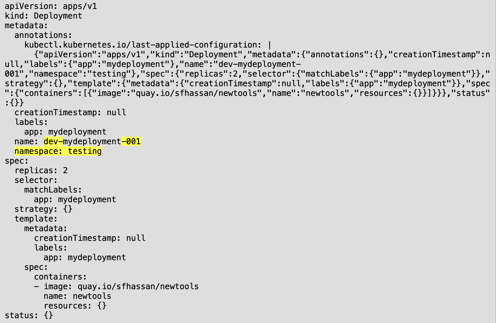

# Kustomization Lab:

Goal: to understand use of Kustomization with OpenShift 

## Create sample manifest:

``` 
mkdir ~/kustomization
cd ~/kustomization
oc create deployment mydeployment --image=quay.io/sfhassan/newtools --replicas=2 -o yaml --dry-run=client > deployment.yaml
```
## Create Kustomization File:
```
cat << EOF > kustomization.yaml
apiVersion: kustomize.config.k8s.io/v1beta1
kind: Kustomization
namespace: testing
namePrefix: dev-
nameSuffix: "-001"
resources:
  - deployment.yaml
EOF
```
## Apply Kustomization: 
```
oc apply -k ./ --dry-run=client -o yaml 
```
The output show that the prefix, suffix and namespace values have been applied from kustomization file: 


