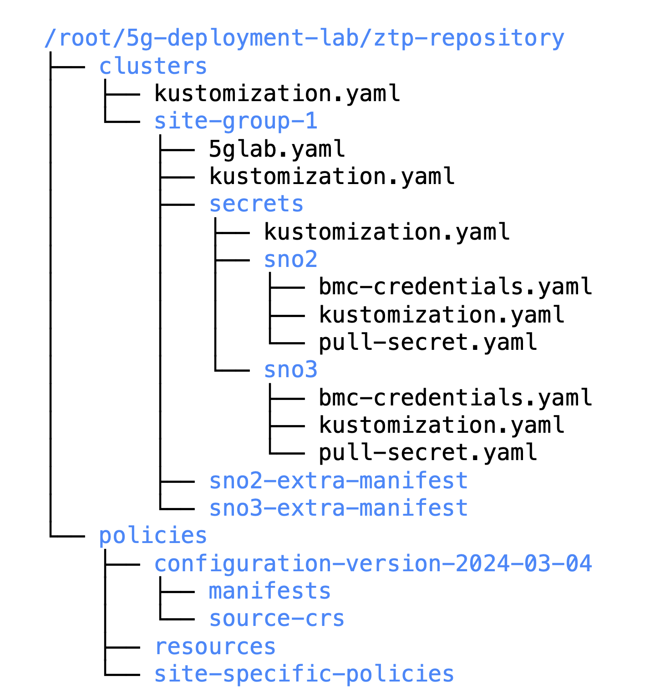

## Create SNO2 & SNO3 Pre-Reqs:

There are two pre-requisites to site config: 
* Secret for BMC
* Pull-Secret for Registry

### Defining BMC Secret for SNO2 & SNO3: 

The username and password for both BMC is `admin` , `admin`. Lets find out what it would be with base64 encoded : 

> echo -n admin | base64 <br>
> YWRtaW4=

Now define the secret in the `secrets` directory: 
```
cat <<EOF > ~/5g-deployment-lab/ztp-repository/clusters/site-group-1/secrets/sno2/bmc-credentials.yaml
---
apiVersion: v1
kind: Secret
metadata:
  name: sno2-bmc-credentials
  namespace: sno2
data:
  username: "YWRtaW4="
  password: "YWRtaW4="
type: Opaque
EOF
```

```
cat <<EOF > ~/5g-deployment-lab/ztp-repository/clusters/site-group-1/secrets/sno3/bmc-credentials.yaml
apiVersion: v1
kind: Secret
metadata:
  name: sno3-bmc-credentials
  namespace: sno3
data:
  username: "YWRtaW4="
  password: "YWRtaW4="
type: Opaque
EOF
```

### Defining Pull Secret: 
The pull secret for locally (preconfigured) registry is `admin`, `r3dh4t1!`, so its base64 encoding will be as follows: 

> echo -n admin:r3dh4t1! | base64 <br>
> YWRtaW46cjNkaDR0MSE=

This secret can now be configured. Note that this is being configured per namespace, hence seperate manifests for both clusters:  

```
cat <<EOF > ~/5g-deployment-lab/ztp-repository/clusters/site-group-1/secrets/sno2/pull-secret.yaml
---
apiVersion: v1
kind: Secret
metadata:
  name: disconnected-registry-pull-secret
  namespace: sno2
stringData:
  .dockerconfigjson: '{"auths":{"infra.5g-deployment.lab:8443":{"auth":"YWRtaW46cjNkaDR0MSE="}}}'
  type: kubernetes.io/dockerconfigjson
EOF
```
```
cat <<EOF > ~/5g-deployment-lab/ztp-repository/clusters/site-group-1/secrets/sno3/pull-secret.yaml
---
apiVersion: v1
kind: Secret
metadata:
  name: disconnected-registry-pull-secret
  namespace: sno3
stringData:
  .dockerconfigjson: '{"auths":{"infra.5g-deployment.lab:8443":{"auth":"YWRtaW46cjNkaDR0MSE="}}}'
  type: kubernetes.io/dockerconfigjson
EOF
```

### Point to both secrets as resources: 

The `site-group-1/secrets` directory contains all the secrets for the varlous clusters. The `kustomization` file here points to the sub-directories where secrets for required clusters are being stored. 

```
cat <<EOF > ~/5g-deployment-lab/ztp-repository/clusters/site-group-1/secrets/kustomization.yaml
---
apiVersion: kustomize.config.k8s.io/v1beta1
kind: Kustomization
resources:
  - sno2/
#  - sno3/
EOF
```

Within `site-group-1/secrets/sno2`, the kustomization file should point to both of these manifests, identifying these are resources: 

```
cat <<EOF > ~/5g-deployment-lab/ztp-repository/clusters/site-group-1/secrets/sno2/kustomization.yaml
---
apiVersion: kustomize.config.k8s.io/v1beta1
kind: Kustomization
resources:
  - bmc-credentials.yaml
  - pull-secret.yaml
EOF
```

Similiarly, within `site-group-1/secrets/sno3` the kustomization file should point to both these resources: 
```
cat <<EOF > ~/5g-deployment-lab/ztp-repository/clusters/site-group-1/secrets/sno3/kustomization.yaml
---
apiVersion: kustomize.config.k8s.io/v1beta1
kind: Kustomization
resources:
  - bmc-credentials.yaml
  - pull-secret.yaml
EOF
```

### Create Site-Config for SNO2:


```
cat <<EOF > ~/5g-deployment-lab/ztp-repository/clusters/site-group-1/5glab.yaml
---
apiVersion: ran.openshift.io/v1
kind: SiteConfig
metadata:
  name: "5glab"
  namespace: "5glab"
spec:
  # The base domain used by our SNOs
  baseDomain: "5g-deployment.lab"
  # The secret name of the secret containing the pull secret for our disconnected registry
  pullSecretRef:
    name: "disconnected-registry-pull-secret"
  # The OCP release we will be deploying otherwise specified (this can be configured per cluster as well)
  clusterImageSetNameRef: "active-ocp-version"
  # The ssh public key that will be injected into our SNOs authorized_keys
  sshPublicKey: "ssh-rsa AAAAB3NzaC1yc2EAAAADAQABAAACAQC5pFKFLOuxrd9Q/TRu9sRtwGg2PV+kl2MHzBIGUhCcR0LuBJk62XG9tQWPQYTQ3ZUBKb6pRTqPXg+cDu5FmcpTwAKzqgUb6ArnjECxLJzJvWieBJ7k45QzhlZPeiN2Omik5bo7uM/P1YIo5pTUdVk5wJjaMOb7Xkcmbjc7r22xY54cce2Wb7B1QDtLWJkq++eJHSX2GlEjfxSlEvQzTN7m2N5pmoZtaXpLKcbOqtuSQSVKC4XPgb57hgEs/ZZy/LbGGHZyLAW5Tqfk1JCTFGm6Q+oOd3wAOF1SdUxM7frdrN3UOB12u/E6YuAx3fDvoNZvcrCYEpjkfrsjU91oz78aETZV43hOK9NWCOhdX5djA7G35/EMn1ifanVoHG34GwNuzMdkb7KdYQUztvsXIC792E2XzWfginFZha6kORngokZ2DwrzFj3wgvmVyNXyEOqhwi6LmlsYdKxEvUtiYhdISvh2Y9GPrFcJ5DanXe7NVAKXe5CyERjBnxWktqAPBzXJa36FKIlkeVF5G+NWgufC6ZWkDCD98VZDiPP9sSgqZF8bSR4l4/vxxAW4knKIZv11VX77Sa1qZOR9Ml12t5pNGT7wDlSOiDqr5EWsEexga/2s/t9itvfzhcWKt+k66jd8tdws2dw6+8JYJeiBbU63HBjxCX+vCVZASrNBjiXhFw=="
  clusters:
  - clusterName: "sno2"
    # The sdn plugin that will be used
    networkType: "OVNKubernetes"
    # extraManifestPath: sno2-extra-manifest
    # Cluster labels (this will be used by RHACM)
    clusterLabels:
      common: "ocp414"
      logicalGroup: "active"
      group-du-sno: ""
      du-site: "sno2"
      du-zone: "europe"
    # Pod's SDN network range
    clusterNetwork:
      - cidr: "10.128.0.0/14"
        hostPrefix: 23
    # Network range where the SNO is connected
    machineNetwork:
      - cidr: "192.168.125.0/24"
    # Services SDN network range
    serviceNetwork:
      - "172.30.0.0/16"
    # cpuPartitioningMode: AllNodes
    additionalNTPSources:
      - infra.5g-deployment.lab
    # holdInstallation: false
    nodes:
      - hostName: "sno2.5g-deployment.lab"
        role: "master"
        # We can add custom labels to our nodes, these will be added once the node joins the cluster
        nodeLabels:
          5gran.lab/my-custom-label: ""
        bmcAddress: "redfish-virtualmedia://192.168.125.1:9000/redfish/v1/Systems/local/sno2"
        # The secret name of the secret containing the bmc credentials for our bare metal node
        bmcCredentialsName:
          name: "sno2-bmc-credentials"
        # The MAC Address of the NIC from the bare metal node connected to the machineNetwork
        bootMACAddress: "AA:AA:AA:AA:03:01"
        bootMode: "UEFI"
        rootDeviceHints:
          deviceName: /dev/vda
        nodeNetwork:
          interfaces:
            - name: enp1s0
              macAddress: "AA:AA:AA:AA:03:01"
          config:
            interfaces:
              - name: enp1s0
                type: ethernet
                state: up
                ipv4:
                  enabled: true
                  dhcp: true
                ipv6:
                  enabled: false
EOF
```
and a kustomization to point the site-group-1 locaation:
```
cat <<EOF > ~/5g-deployment-lab/ztp-repository/clusters/site-group-1/kustomization.yaml
---
apiVersion: kustomize.config.k8s.io/v1beta1
kind: Kustomization
generators:
  - 5glab.yaml
resources:
  - secrets/
EOF
```

A top level kustomization should point to the `siteconfig`

```
cat <<EOF > ~/5g-deployment-lab/ztp-repository/clusters/kustomization.yaml
---
apiVersion: kustomize.config.k8s.io/v1beta1
kind: Kustomization
generators:
  - site-group-1/5glab.yaml
resources:
  - site-group-1/secrets/
EOF
```

### Checek the status of directory structure: 

```
tree /root/5g-deployment-lab/ztp-repository
```



### Update GIT: 
```
cd ~/5g-deployment-lab/ztp-repository
git add --all
git commit -m 'Added SNO2 and 5GLab Site information'
git push origin main
cd ~
```

