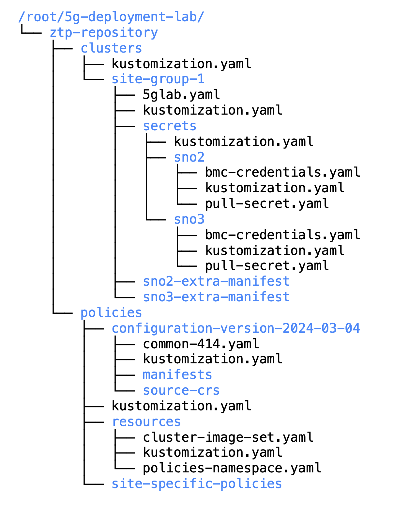

## Configuring Policies:

### Common Policy:

```
cat <<EOF > ~/5g-deployment-lab/ztp-repository/policies/configuration-version-2024-03-04/common-414.yaml
---
apiVersion: ran.openshift.io/v1
kind: PolicyGenTemplate
metadata:
  name: "common"
  namespace: "ztp-policies"
spec:
  bindingRules:
    common: "ocp414"
    logicalGroup: "active"
  mcp: master
  remediationAction: inform
  sourceFiles:
    - fileName: OperatorHub.yaml
      policyName: config-policies
    - fileName: DefaultCatsrc.yaml
      metadata:
        name: redhat-operator-index
      spec:
        image: infra.5g-deployment.lab:8443/redhat/redhat-operator-index:v4.14-1700503430
      policyName: config-policies
    - fileName: ReduceMonitoringFootprint.yaml
      policyName: config-policies
    - fileName: StorageLVMOSubscriptionNS.yaml
      metadata:
        annotations:
          workload.openshift.io/allowed: management
      policyName: subscription-policies
    - fileName: StorageLVMOSubscriptionOperGroup.yaml
      policyName: subscription-policies
    - fileName: StorageLVMOSubscription.yaml
      spec:
        name: lvms-operator
        channel: stable-4.14
        source: redhat-operator-index
      policyName: subscription-policies
EOF
```

```
cat <<EOF > ~/5g-deployment-lab/ztp-repository/policies/configuration-version-2024-03-04/kustomization.yaml
apiVersion: kustomize.config.k8s.io/v1beta1
kind: Kustomization
generators:
- common-414.yaml
EOF
```

### Namespace for policies & clusterimageset:

```
cat <<EOF > ~/5g-deployment-lab/ztp-repository/policies/resources/policies-namespace.yaml
---
apiVersion: v1
kind: Namespace
metadata:
  name: ztp-policies
  labels:
    name: ztp-policies
EOF
```

The cluster image resource being used by clusters is the (disconnected) registry that is hosted locally on this bastion. The `siteconfig` files refer to this resource by using `clusterImageSetNameRef: "active-ocp-version"`.  So this needs to be defined as well. As this is relevant to policy, its manifest is being created under the `policy/resources` location: 


```
cat <<EOF > ~/5g-deployment-lab/ztp-repository/policies/resources/cluster-image-set.yaml
---
apiVersion: hive.openshift.io/v1
kind: ClusterImageSet
metadata:
  name: active-ocp-version
spec:
  releaseImage: infra.5g-deployment.lab:8443/openshift/release-images:4.14.0-x86_64
EOF
```

Kustomization for the namespace: 

```
cat <<EOF > ~/5g-deployment-lab/ztp-repository/policies/resources/kustomization.yaml
---
apiVersion: kustomize.config.k8s.io/v1beta1
kind: Kustomization
resources:
  - policies-namespace.yaml
  - cluster-image-set.yaml
EOF
```

### Top level kustomization : 

```
cat <<EOF > ~/5g-deployment-lab/ztp-repository/policies/kustomization.yaml
apiVersion: kustomize.config.k8s.io/v1beta1
kind: Kustomization
bases:
- resources
#- site-specific-policies
#- configuration-version-2023-09-10_802e68c
#- configuration-version-2023-11-01_39ba72d
- configuration-version-2024-03-04
EOF
```

### Final View: 

The directory structure at this point should look like the following: 

```
tree ~/5g-deployment-lab/
```



### Commit to GIT: 

```
cd ~/5g-deployment-lab/ztp-repository
git add --all
git commit -m 'Added policies information'
git push origin main
cd ~
```
