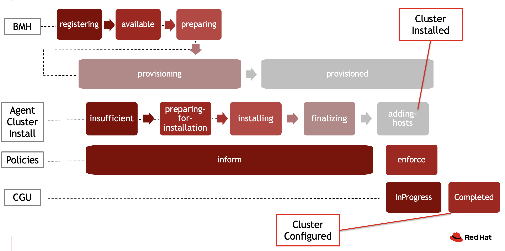
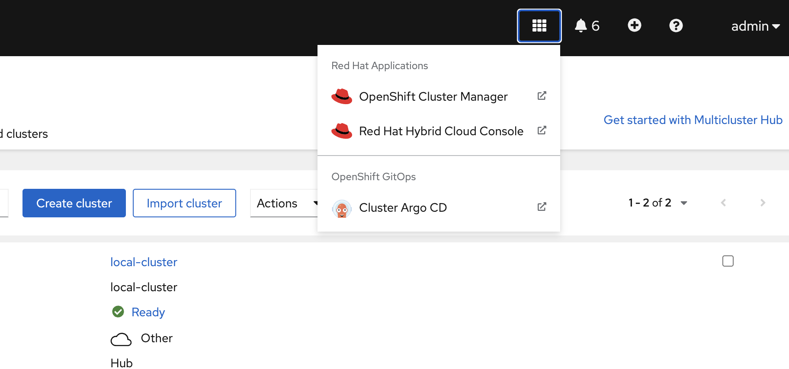
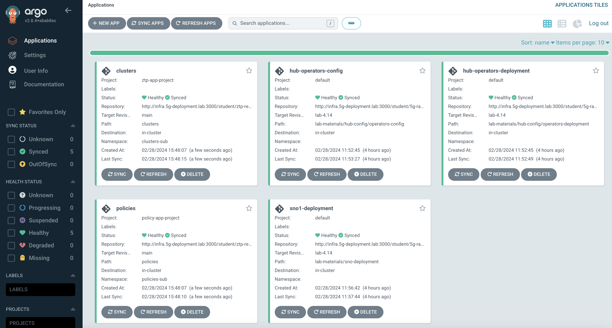
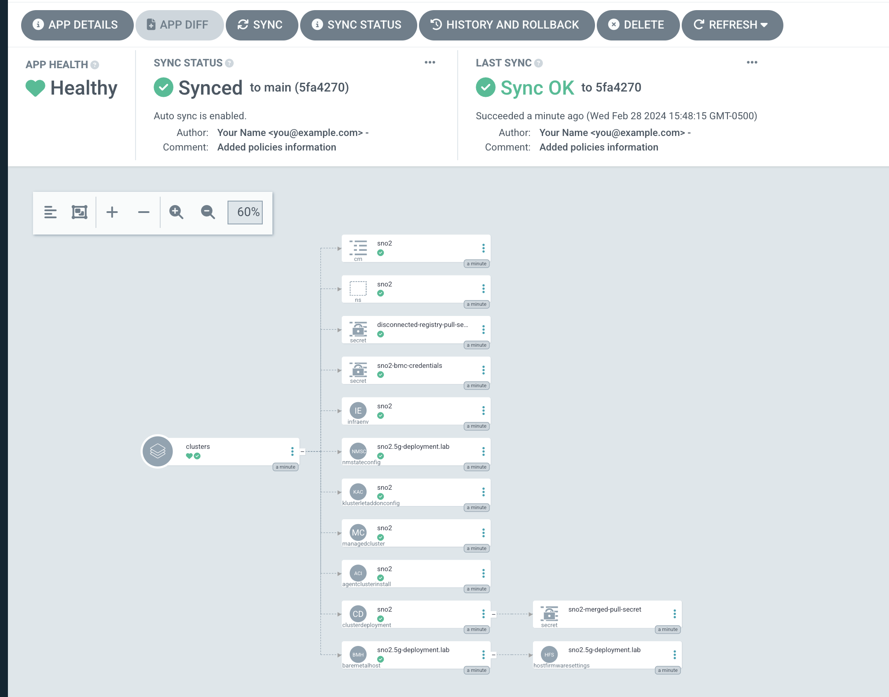
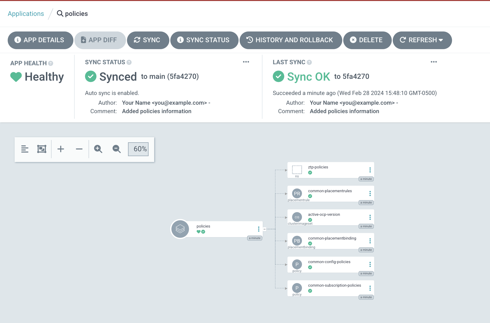
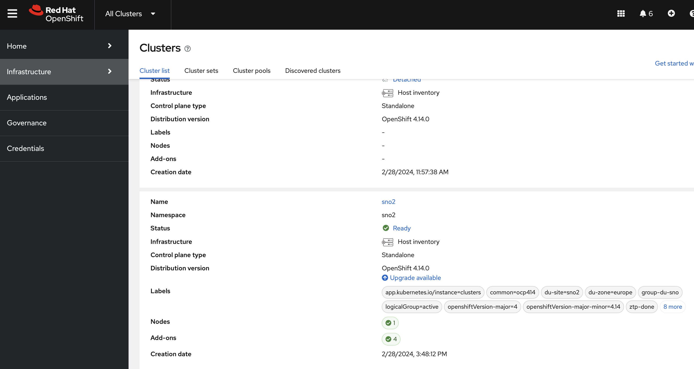
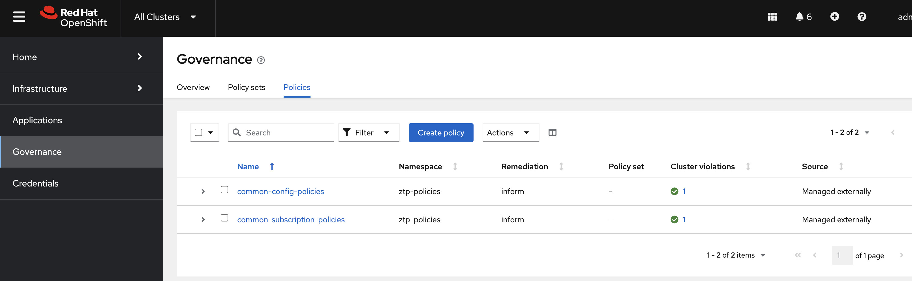

# Install Argo Apps:


## Create the Application manifests:
```
mkdir ~/5g-deployment-lab/deployment
```
```
cat << EOF > ~/5g-deployment-lab/deployment/cluster-app.yaml 
apiVersion: v1
kind: Namespace
metadata:
  name: clusters-sub
---
apiVersion: argoproj.io/v1alpha1
kind: Application
metadata:
  name: clusters
  namespace: openshift-gitops
spec:
  destination:
    server: https://kubernetes.default.svc
    namespace: clusters-sub
  project: ztp-app-project
  source:
    path: clusters
    repoURL: http://infra.5g-deployment.lab:3000/student/ztp-repository.git
    targetRevision: main
  syncPolicy:
    automated:
      prune: true
      selfHeal: true
    syncOptions:
    - CreateNamespace=true
EOF
```

```
cat << EOF > ~/5g-deployment-lab/deployment/policy-app.yaml
apiVersion: v1
kind: Namespace
metadata:
    name: policies-sub
---
apiVersion: argoproj.io/v1alpha1
kind: Application
metadata:
  name: policies
  namespace: openshift-gitops
spec:
  destination:
    server: https://kubernetes.default.svc
    namespace: policies-sub
  project: policy-app-project
  source:
    path: policies
    repoURL: http://infra.5g-deployment.lab:3000/student/ztp-repository.git
    targetRevision: main
  syncPolicy:
    automated:
      prune: true
      selfHeal: true
    syncOptions:
    - CreateNamespace=true
EOF
```

## Create the Projects manifests:

```
cat << EOF > ~/5g-deployment-lab/deployment/app-project.yaml
apiVersion: argoproj.io/v1alpha1
kind: AppProject
metadata:
  name: ztp-app-project
  namespace: openshift-gitops
spec:
  clusterResourceWhitelist:
  - group: 'hive.openshift.io'
    kind: ClusterImageSet
  - group: 'cluster.open-cluster-management.io'
    kind: ManagedCluster
  - group: ''
    kind: Namespace
  destinations:
  - namespace: '*'
    server: '*'
  namespaceResourceWhitelist:
  - group: ''
    kind: ConfigMap
  - group: ''
    kind: Namespace
  - group: ''
    kind: Secret
  - group: 'agent-install.openshift.io'
    kind: InfraEnv
  - group: 'agent-install.openshift.io'
    kind: NMStateConfig
  - group: 'extensions.hive.openshift.io'
    kind: AgentClusterInstall
  - group: 'hive.openshift.io'
    kind: ClusterDeployment
  - group: 'metal3.io'
    kind: BareMetalHost
  - group: 'metal3.io'
    kind: HostFirmwareSettings
  - group: 'agent.open-cluster-management.io'
    kind: KlusterletAddonConfig
  - group: 'cluster.open-cluster-management.io'
    kind: ManagedCluster
  - group: 'ran.openshift.io'
    kind: SiteConfig
  sourceRepos:
  - '*'
EOF
```

```
cat << EOF > ~/5g-deployment-lab/deployment/policies-app-project.yaml
---
apiVersion: argoproj.io/v1alpha1
kind: AppProject
metadata:
  name: policy-app-project
  namespace: openshift-gitops
spec:
  clusterResourceWhitelist:
  - group: ''
    kind: Namespace
  - group: hive.openshift.io
    kind: ClusterImageSet
  destinations:
  - namespace: 'ztp*'
    server: '*'
  - namespace: 'policies-sub'
    server: '*'
  namespaceResourceWhitelist:
  - group: ''
    kind: ConfigMap
  - group: ''
    kind: Namespace
  - group: 'apps.open-cluster-management.io'
    kind: PlacementRule
  - group: 'policy.open-cluster-management.io'
    kind: Policy
  - group: 'policy.open-cluster-management.io'
    kind: PlacementBinding
  - group: 'ran.openshift.io'
    kind: PolicyGenTemplate
  - group: cluster.open-cluster-management.io
    kind: Placement
  - group: policy.open-cluster-management.io
    kind: PolicyGenerator
  - group: policy.open-cluster-management.io
    kind: PolicySet
  - group: cluster.open-cluster-management.io
    kind: ManagedClusterSetBinding
  sourceRepos:
  - '*'
EOF
```

## Create the Role and Role Binding for Argo to use:

```
cat << EOF > ~/5g-deployment-lab/deployment/gitops-policy-rolebinding.yaml
apiVersion: rbac.authorization.k8s.io/v1
kind: ClusterRoleBinding
metadata:
  name: gitops-policy
roleRef:
  apiGroup: rbac.authorization.k8s.io
  kind: ClusterRole
  name: open-cluster-management:cluster-manager-admin
subjects:
- kind: ServiceAccount
  name: openshift-gitops-argocd-application-controller
  namespace: openshift-gitops
EOF
```

```
cat << EOF > ~/5g-deployment-lab/deployment/gitops-cluster-rolebinding.yaml
apiVersion: rbac.authorization.k8s.io/v1
kind: ClusterRoleBinding
metadata:
  name: gitops-cluster
roleRef:
  apiGroup: rbac.authorization.k8s.io
  kind: ClusterRole
  name: cluster-admin
subjects:
- kind: ServiceAccount
  name: openshift-gitops-argocd-application-controller
  namespace: openshift-gitops
EOF
```

## Create the Kustomization file to apply all the manifests:

```
cat << EOF > ~/5g-deployment-lab/deployment/kustomization.yaml
apiVersion: kustomize.config.k8s.io/v1beta1
kind: Kustomization

resources:
  - app-project.yaml
  - policies-app-project.yaml
  - gitops-policy-rolebinding.yaml
  - gitops-cluster-rolebinding.yaml
  - cluster-app.yaml
  - policy-app.yaml
EOF
```

## Verify that all the files are in place:

```
ls ~/5g-deployment-lab/deployment/
```

> app-project.yaml&nbsp;&nbsp;gitops-cluster-rolebinding.yaml&nbsp;&nbsp;kustomization.yaml&nbsp;&nbsp;&nbsp;&nbsp;&nbsp;&nbsp;&nbsp;&nbsp;&nbsp;policy-app.yaml<br>
> cluster-app.yaml&nbsp;&nbsp;gitops-policy-rolebinding.yaml&nbsp;&nbsp;&nbsp;policies-app-project.yaml<br>

## Run the applicaitons: 

To apply the manifests created above, use the following: 

```
oc apply -k ~/5g-deployment-lab/deployment/
```

Output will show the following: 
> namespace/clusters-sub created<br>
> namespace/policies-sub created<br>
> clusterrolebinding.rbac.authorization.k8s.io/gitops-cluster created<br>
> clusterrolebinding.rbac.authorization.k8s.io/gitops-policy created<br>
> appproject.argoproj.io/policy-app-project created<br>
> appproject.argoproj.io/ztp-app-project created<br>
> application.argoproj.io/clusters created<br>
> application.argoproj.io/policies created<br>

# Verification: 

### Verify the status of application using CLI:

```
oc get applications.argoproj.io -A
```

NAMESPACE          NAME                       SYNC STATUS   HEALTH STATUS
openshift-gitops   clusters                   OutOfSync     Healthy
openshift-gitops   hub-operators-config       Synced        Healthy
openshift-gitops   hub-operators-deployment   Synced        Healthy
openshift-gitops   policies                   Synced        Healthy
openshift-gitops   sno1-deployment            Synced        Healthy

### Verify the status of policies using CLI:

```
oc get policies -A
```

> NAMESPACE&nbsp;&nbsp;&nbsp;&nbsp;&nbsp;&nbsp;NAME&nbsp;&nbsp;&nbsp;&nbsp;&nbsp;&nbsp;&nbsp;&nbsp;&nbsp;&nbsp;&nbsp;&nbsp;&nbsp;&nbsp;&nbsp;&nbsp;&nbsp;&nbsp;&nbsp;&nbsp;&nbsp;&nbsp;&nbsp;&nbsp;&nbsp;&nbsp;&nbsp;REMEDIATION&nbsp;ACTION&nbsp;&nbsp;&nbsp;COMPLIANCE&nbsp;STATE&nbsp;&nbsp;&nbsp;AGE<br>
> ztp-policies&nbsp;&nbsp;&nbsp;common-config-policies&nbsp;&nbsp;&nbsp;&nbsp;&nbsp;&nbsp;&nbsp;&nbsp;&nbsp;inform&nbsp;&nbsp;&nbsp;&nbsp;&nbsp;&nbsp;&nbsp;&nbsp;&nbsp;&nbsp;&nbsp;&nbsp;&nbsp;&nbsp;&nbsp;&nbsp;&nbsp;&nbsp;&nbsp;&nbsp;&nbsp;&nbsp;&nbsp;&nbsp;&nbsp;&nbsp;&nbsp;&nbsp;&nbsp;&nbsp;&nbsp;&nbsp;&nbsp;&nbsp;17s<br>
> ztp-policies&nbsp;&nbsp;&nbsp;common-subscription-policies&nbsp;&nbsp;&nbsp;inform&nbsp;&nbsp;&nbsp;&nbsp;&nbsp;&nbsp;&nbsp;&nbsp;&nbsp;&nbsp;&nbsp;&nbsp;&nbsp;&nbsp;&nbsp;&nbsp;&nbsp;&nbsp;&nbsp;&nbsp;&nbsp;&nbsp;&nbsp;&nbsp;&nbsp;&nbsp;&nbsp;&nbsp;&nbsp;&nbsp;&nbsp;&nbsp;&nbsp;&nbsp;17s<br>
 
This will be soon followed by the following, where the policies have been copied over to the cluster's namespacE: 

> NAMESPACE&nbsp;&nbsp;&nbsp;&nbsp;&nbsp;&nbsp;NAME&nbsp;&nbsp;&nbsp;&nbsp;&nbsp;&nbsp;&nbsp;&nbsp;&nbsp;&nbsp;&nbsp;&nbsp;&nbsp;&nbsp;&nbsp;&nbsp;&nbsp;&nbsp;&nbsp;&nbsp;&nbsp;&nbsp;&nbsp;&nbsp;&nbsp;&nbsp;&nbsp;&nbsp;&nbsp;&nbsp;&nbsp;&nbsp;&nbsp;&nbsp;&nbsp;&nbsp;&nbsp;&nbsp;&nbsp;&nbsp;REMEDIATION&nbsp;ACTION&nbsp;&nbsp;&nbsp;COMPLIANCE&nbsp;STATE&nbsp;&nbsp;&nbsp;AGE<br>
> sno2&nbsp;&nbsp;&nbsp;&nbsp;&nbsp;&nbsp;&nbsp;&nbsp;&nbsp;&nbsp;&nbsp;ztp-policies.common-config-policies&nbsp;&nbsp;&nbsp;&nbsp;&nbsp;&nbsp;&nbsp;&nbsp;&nbsp;inform&nbsp;&nbsp;&nbsp;&nbsp;&nbsp;&nbsp;&nbsp;&nbsp;&nbsp;&nbsp;&nbsp;&nbsp;&nbsp;&nbsp;&nbsp;&nbsp;&nbsp;&nbsp;&nbsp;&nbsp;&nbsp;&nbsp;&nbsp;&nbsp;&nbsp;&nbsp;&nbsp;&nbsp;&nbsp;&nbsp;&nbsp;&nbsp;&nbsp;&nbsp;8s<br>
> sno2&nbsp;&nbsp;&nbsp;&nbsp;&nbsp;&nbsp;&nbsp;&nbsp;&nbsp;&nbsp;&nbsp;ztp-policies.common-subscription-policies&nbsp;&nbsp;&nbsp;inform&nbsp;&nbsp;&nbsp;&nbsp;&nbsp;&nbsp;&nbsp;&nbsp;&nbsp;&nbsp;&nbsp;&nbsp;&nbsp;&nbsp;&nbsp;&nbsp;&nbsp;&nbsp;&nbsp;&nbsp;&nbsp;&nbsp;&nbsp;&nbsp;&nbsp;&nbsp;&nbsp;&nbsp;&nbsp;&nbsp;&nbsp;&nbsp;&nbsp;&nbsp;8s<br>
> ztp-policies&nbsp;&nbsp;&nbsp;common-config-policies&nbsp;&nbsp;&nbsp;&nbsp;&nbsp;&nbsp;&nbsp;&nbsp;&nbsp;&nbsp;&nbsp;&nbsp;&nbsp;&nbsp;&nbsp;&nbsp;&nbsp;&nbsp;&nbsp;&nbsp;&nbsp;&nbsp;inform&nbsp;&nbsp;&nbsp;&nbsp;&nbsp;&nbsp;&nbsp;&nbsp;&nbsp;&nbsp;&nbsp;&nbsp;&nbsp;&nbsp;&nbsp;&nbsp;&nbsp;&nbsp;&nbsp;&nbsp;&nbsp;&nbsp;&nbsp;&nbsp;&nbsp;&nbsp;&nbsp;&nbsp;&nbsp;&nbsp;&nbsp;&nbsp;&nbsp;&nbsp;13s<br>
> ztp-policies&nbsp;&nbsp;&nbsp;common-subscription-policies&nbsp;&nbsp;&nbsp;&nbsp;&nbsp;&nbsp;&nbsp;&nbsp;&nbsp;&nbsp;&nbsp;&nbsp;&nbsp;&nbsp;&nbsp;&nbsp;inform&nbsp;&nbsp;&nbsp;&nbsp;&nbsp;&nbsp;&nbsp;&nbsp;&nbsp;&nbsp;&nbsp;&nbsp;&nbsp;&nbsp;&nbsp;&nbsp;&nbsp;&nbsp;&nbsp;&nbsp;&nbsp;&nbsp;&nbsp;&nbsp;&nbsp;&nbsp;&nbsp;&nbsp;&nbsp;&nbsp;&nbsp;&nbsp;&nbsp;&nbsp;13s<br>

### Continuous Monitoring:

You can use the following script to continuously monitor the key CRs and their status as the ZTP process progresses: 

```
while true; do echo "################################"; echo "# `date` #"; echo "################################"; echo "---------------- BMH ----------------"; oc get bmh -A; echo "---------------- AgentClusterInstall ----------------"; oc get agentclusterinstall -A; echo "---------------- Clusters ----------------"; oc get managedclusters sno2 --show-labels; echo "---------------- Policies ----------------"; oc get policy -A; echo "---------------- CGU ----------------"; oc get cgu -A; sleep 15; done
```

Just as a reference, the following figure shows the transitions that the CRs captured in the above output go through: 



## Verify the status of applications using GUI: 

You can conenct to the OpenShift GitOps GUI using either the credentials (steps to find out the url and credentials can be found [here](https://gitlab.consulting.redhat.com/shassan/bootcamp/-/blob/main/gitops.md)), or you can use the option to authenticate using OpenShift Console by using the applications menu as shown here: 



If using the OpenShift option, you will be asked to allow the application (ArgoCD) to be authorized, and might need to provide your OCP console credentials again. Once connected the ArgoCD GUI, you should see that both the "Cluster" and "Policies" applications are healthy and in Synch (there will be other applications on the screen as well, which have been run previously during lab setup)



Click on the Cluster and Policies applications to see the translated CRs by the ZTP Plugin. If you dont see these in a Healthy and Synced state, you might need to click on the `Refresh` button on the GUI. If that doesn't give the Healthy status, then you will need some troubleshooting to be done.  Normally you will see the followings: 





# Track Cluster Deployment: 

## Checking for OpenShift Deployment:

Watch the `oc get managedclusters` and `oc get agentclusterinstall -n sno2` outputs to determine if OpenShift has been deployed on the cluster. The outputs should show: 

```
oc get managedclusters
```
> NAME&nbsp;&nbsp;&nbsp;&nbsp;&nbsp;&nbsp;&nbsp;&nbsp;&nbsp;&nbsp;&nbsp;&nbsp;HUB&nbsp;ACCEPTED&nbsp;&nbsp;&nbsp;MANAGED&nbsp;CLUSTER&nbsp;URLS&nbsp;&nbsp;&nbsp;&nbsp;&nbsp;&nbsp;&nbsp;&nbsp;&nbsp;&nbsp;&nbsp;&nbsp;&nbsp;&nbsp;&nbsp;&nbsp;&nbsp;&nbsp;&nbsp;&nbsp;&nbsp;JOINED&nbsp;&nbsp;&nbsp;AVAILABLE&nbsp;&nbsp;&nbsp;AGE                      
> local-cluster&nbsp;&nbsp;&nbsp;true&nbsp;&nbsp;&nbsp;&nbsp;&nbsp;&nbsp;&nbsp;&nbsp;&nbsp;&nbsp;&nbsp;https://api.hub.5g-deployment.lab:6443 &nbsp;&nbsp;&nbsp;True&nbsp;&nbsp;&nbsp;&nbsp;&nbsp;True&nbsp;&nbsp;&nbsp;&nbsp;&nbsp;&nbsp;&nbsp;&nbsp;4h3m<br>
> sno2&nbsp;&nbsp;&nbsp;&nbsp;&nbsp;&nbsp;&nbsp;&nbsp;&nbsp;&nbsp;&nbsp;&nbsp;true&nbsp;&nbsp;&nbsp;&nbsp;&nbsp;&nbsp;&nbsp;&nbsp;&nbsp;&nbsp;&nbsp;&nbsp;&nbsp;&nbsp;&nbsp;&nbsp;&nbsp;&nbsp;&nbsp;&nbsp;&nbsp;&nbsp;&nbsp;&nbsp;&nbsp;&nbsp;&nbsp;&nbsp;&nbsp;&nbsp;&nbsp;&nbsp;&nbsp;&nbsp;&nbsp;&nbsp;&nbsp;&nbsp;&nbsp;&nbsp;&nbsp;&nbsp;&nbsp;&nbsp;&nbsp;&nbsp;&nbsp;&nbsp;&nbsp;&nbsp;&nbsp;&nbsp;&nbsp;&nbsp;&nbsp;&nbsp;&nbsp;&nbsp;&nbsp;&nbsp;&nbsp;Unknown&nbsp;&nbsp;&nbsp;&nbsp;&nbsp;9m29s<br>

```
oc get agentclusterinstall -n sno2
```
> NAME&nbsp;&nbsp;&nbsp;CLUSTER&nbsp;&nbsp;&nbsp;STATE<br>
> sno2&nbsp;&nbsp;&nbsp;sno2&nbsp;&nbsp;&nbsp;&nbsp;&nbsp;&nbsp;installing<br>

You should be looking for the following output that shows `sno2` has JOINED the management cluster and is AVAILABLE: 
```
oc get managedcluster sno2
```
> NAME&nbsp;&nbsp;&nbsp;HUB&nbsp;ACCEPTED&nbsp;&nbsp;&nbsp;MANAGED&nbsp;CLUSTER&nbsp;URLS&nbsp;&nbsp;&nbsp;&nbsp;&nbsp;&nbsp;&nbsp;&nbsp;&nbsp;&nbsp;&nbsp;&nbsp;&nbsp;&nbsp;&nbsp;&nbsp;&nbsp;&nbsp;&nbsp;&nbsp;&nbsp;&nbsp;JOINED&nbsp;&nbsp;&nbsp;AVAILABLE&nbsp;&nbsp;&nbsp;AGE<br>
> sno2&nbsp;&nbsp;&nbsp;true&nbsp;&nbsp;&nbsp;&nbsp;&nbsp;&nbsp;&nbsp;&nbsp;&nbsp;&nbsp;&nbsp;https://api.sno2.5g-deployment.lab:6443 &nbsp;&nbsp;&nbsp;True&nbsp;&nbsp;&nbsp;&nbsp;&nbsp;True&nbsp;&nbsp;&nbsp;&nbsp;&nbsp;&nbsp;&nbsp;&nbsp;34m<br>

**NOTE** It might take around 20-30 minutes for the cluster installation to complete

## Checking for Policy Deployment: 

At this point, the policies should start to take affect. If you run `oc get policies -A` soon after the cluster installation is completed, you will see: 

> NAMESPACE&nbsp;&nbsp;&nbsp;&nbsp;&nbsp;&nbsp;NAME&nbsp;&nbsp;&nbsp;&nbsp;&nbsp;&nbsp;&nbsp;&nbsp;&nbsp;&nbsp;&nbsp;&nbsp;&nbsp;&nbsp;&nbsp;&nbsp;&nbsp;&nbsp;&nbsp;&nbsp;&nbsp;&nbsp;&nbsp;&nbsp;&nbsp;&nbsp;&nbsp;&nbsp;&nbsp;&nbsp;&nbsp;&nbsp;&nbsp;&nbsp;&nbsp;&nbsp;&nbsp;&nbsp;&nbsp;&nbsp;&nbsp;&nbsp;&nbsp;&nbsp;REMEDIATION&nbsp;ACTION&nbsp;&nbsp;&nbsp;COMPLIANCE&nbsp;STATE&nbsp;&nbsp;&nbsp;AGE<br>         
> sno2&nbsp;&nbsp;&nbsp;&nbsp;&nbsp;&nbsp;&nbsp;&nbsp;&nbsp;&nbsp;&nbsp;ztp-install.sno2-common-config-policies-dzdh7&nbsp;&nbsp;&nbsp;enforce&nbsp;&nbsp;&nbsp;&nbsp;&nbsp;&nbsp;&nbsp;&nbsp;&nbsp;&nbsp;&nbsp;&nbsp;&nbsp;&nbsp;NonCompliant&nbsp;&nbsp;&nbsp;&nbsp;&nbsp;&nbsp;&nbsp;54s<br>
> sno2&nbsp;&nbsp;&nbsp;&nbsp;&nbsp;&nbsp;&nbsp;&nbsp;&nbsp;&nbsp;&nbsp;ztp-policies.common-config-policies&nbsp;&nbsp;&nbsp;&nbsp;&nbsp;&nbsp;&nbsp;&nbsp;&nbsp;&nbsp;&nbsp;&nbsp;&nbsp;inform&nbsp;&nbsp;&nbsp;&nbsp;&nbsp;&nbsp;&nbsp;&nbsp;&nbsp;&nbsp;&nbsp;&nbsp;&nbsp;&nbsp;&nbsp;NonCompliant&nbsp;&nbsp;&nbsp;&nbsp;&nbsp;&nbsp;&nbsp;34m<br>
> sno2&nbsp;&nbsp;&nbsp;&nbsp;&nbsp;&nbsp;&nbsp;&nbsp;&nbsp;&nbsp;&nbsp;ztp-policies.common-subscription-policies&nbsp;&nbsp;&nbsp;&nbsp;&nbsp;&nbsp;&nbsp;inform&nbsp;&nbsp;&nbsp;&nbsp;&nbsp;&nbsp;&nbsp;&nbsp;&nbsp;&nbsp;&nbsp;&nbsp;&nbsp;&nbsp;&nbsp;NonCompliant&nbsp;&nbsp;&nbsp;&nbsp;&nbsp;&nbsp;&nbsp;34m<br>
> ztp-install&nbsp;&nbsp;&nbsp;&nbsp;sno2-common-config-policies-dzdh7&nbsp;&nbsp;&nbsp;&nbsp;&nbsp;&nbsp;&nbsp;&nbsp;&nbsp;&nbsp;&nbsp;&nbsp;&nbsp;&nbsp;&nbsp;enforce&nbsp;&nbsp;&nbsp;&nbsp;&nbsp;&nbsp;&nbsp;&nbsp;&nbsp;&nbsp;&nbsp;&nbsp;&nbsp;&nbsp;NonCompliant&nbsp;&nbsp;&nbsp;&nbsp;&nbsp;&nbsp;&nbsp;54s<br>
> ztp-install&nbsp;&nbsp;&nbsp;&nbsp;sno2-common-subscription-policies-8mnbq&nbsp;&nbsp;&nbsp;&nbsp;&nbsp;&nbsp;&nbsp;&nbsp;&nbsp;enforce&nbsp;&nbsp;&nbsp;&nbsp;&nbsp;&nbsp;&nbsp;&nbsp;&nbsp;&nbsp;&nbsp;&nbsp;&nbsp;&nbsp;&nbsp;&nbsp;&nbsp;&nbsp;&nbsp;&nbsp;&nbsp;&nbsp;&nbsp;&nbsp;&nbsp;&nbsp;&nbsp;&nbsp;&nbsp;&nbsp;&nbsp;&nbsp;&nbsp;54s<br>
> ztp-policies&nbsp;&nbsp;&nbsp;common-config-policies&nbsp;&nbsp;&nbsp;&nbsp;&nbsp;&nbsp;&nbsp;&nbsp;&nbsp;&nbsp;&nbsp;&nbsp;&nbsp;&nbsp;&nbsp;&nbsp;&nbsp;&nbsp;&nbsp;&nbsp;&nbsp;&nbsp;&nbsp;&nbsp;&nbsp;&nbsp;inform&nbsp;&nbsp;&nbsp;&nbsp;&nbsp;&nbsp;&nbsp;&nbsp;&nbsp;&nbsp;&nbsp;&nbsp;&nbsp;&nbsp;&nbsp;NonCompliant&nbsp;&nbsp;&nbsp;&nbsp;&nbsp;&nbsp;&nbsp;34m<br>
> ztp-policies&nbsp;&nbsp;&nbsp;common-subscription-policies&nbsp;&nbsp;&nbsp;&nbsp;&nbsp;&nbsp;&nbsp;&nbsp;&nbsp;&nbsp;&nbsp;&nbsp;&nbsp;&nbsp;&nbsp;&nbsp;&nbsp;&nbsp;&nbsp;&nbsp;inform&nbsp;&nbsp;&nbsp;&nbsp;&nbsp;&nbsp;&nbsp;&nbsp;&nbsp;&nbsp;&nbsp;&nbsp;&nbsp;&nbsp;&nbsp;NonCompliant&nbsp;&nbsp;&nbsp;&nbsp;&nbsp;&nbsp;&nbsp;34m<br>

Wait for policies to be fully enforced. At that point, you will see: 

> NAMESPACE&nbsp;&nbsp;&nbsp;&nbsp;&nbsp;&nbsp;NAME&nbsp;&nbsp;&nbsp;&nbsp;&nbsp;&nbsp;&nbsp;&nbsp;&nbsp;&nbsp;&nbsp;&nbsp;&nbsp;&nbsp;&nbsp;&nbsp;&nbsp;&nbsp;&nbsp;&nbsp;&nbsp;&nbsp;&nbsp;&nbsp;&nbsp;&nbsp;&nbsp;&nbsp;&nbsp;&nbsp;&nbsp;&nbsp;&nbsp;&nbsp;&nbsp;&nbsp;&nbsp;&nbsp;&nbsp;&nbsp;REMEDIATION&nbsp;ACTION&nbsp;&nbsp;&nbsp;COMPLIANCE&nbsp;STATE&nbsp;&nbsp;&nbsp;AGE<br>
> sno2&nbsp;&nbsp;&nbsp;&nbsp;&nbsp;&nbsp;&nbsp;&nbsp;&nbsp;&nbsp;&nbsp;ztp-policies.common-config-policies&nbsp;&nbsp;&nbsp;&nbsp;&nbsp;&nbsp;&nbsp;&nbsp;&nbsp;inform&nbsp;&nbsp;&nbsp;&nbsp;&nbsp;&nbsp;&nbsp;&nbsp;&nbsp;&nbsp;&nbsp;&nbsp;&nbsp;&nbsp;&nbsp;&nbsp;&nbsp;&nbsp;&nbsp;&nbsp;&nbsp;&nbsp;&nbsp;&nbsp;&nbsp;&nbsp;&nbsp;&nbsp;&nbsp;&nbsp;&nbsp;&nbsp;&nbsp;&nbsp;30m<br>
> sno2&nbsp;&nbsp;&nbsp;&nbsp;&nbsp;&nbsp;&nbsp;&nbsp;&nbsp;&nbsp;&nbsp;ztp-policies.common-subscription-policies&nbsp;&nbsp;&nbsp;inform&nbsp;&nbsp;&nbsp;&nbsp;&nbsp;&nbsp;&nbsp;&nbsp;&nbsp;&nbsp;&nbsp;&nbsp;&nbsp;&nbsp;&nbsp;&nbsp;&nbsp;&nbsp;&nbsp;&nbsp;&nbsp;&nbsp;&nbsp;&nbsp;&nbsp;&nbsp;&nbsp;&nbsp;&nbsp;&nbsp;&nbsp;&nbsp;&nbsp;&nbsp;30m<br>
> ztp-policies&nbsp;&nbsp;&nbsp;common-config-policies&nbsp;&nbsp;&nbsp;&nbsp;&nbsp;&nbsp;&nbsp;&nbsp;&nbsp;&nbsp;&nbsp;&nbsp;&nbsp;&nbsp;&nbsp;&nbsp;&nbsp;&nbsp;&nbsp;&nbsp;&nbsp;&nbsp;inform&nbsp;&nbsp;&nbsp;&nbsp;&nbsp;&nbsp;&nbsp;&nbsp;&nbsp;&nbsp;&nbsp;&nbsp;&nbsp;&nbsp;&nbsp;&nbsp;&nbsp;&nbsp;&nbsp;&nbsp;&nbsp;&nbsp;&nbsp;&nbsp;&nbsp;&nbsp;&nbsp;&nbsp;&nbsp;&nbsp;&nbsp;&nbsp;&nbsp;&nbsp;30m<br>
> ztp-policies&nbsp;&nbsp;&nbsp;common-subscription-policies&nbsp;&nbsp;&nbsp;&nbsp;&nbsp;&nbsp;&nbsp;&nbsp;&nbsp;&nbsp;&nbsp;&nbsp;&nbsp;&nbsp;&nbsp;&nbsp;inform&nbsp;&nbsp;&nbsp;&nbsp;&nbsp;&nbsp;&nbsp;&nbsp;&nbsp;&nbsp;&nbsp;&nbsp;&nbsp;&nbsp;&nbsp;&nbsp;&nbsp;&nbsp;&nbsp;&nbsp;&nbsp;&nbsp;&nbsp;&nbsp;&nbsp;&nbsp;&nbsp;&nbsp;&nbsp;&nbsp;&nbsp;&nbsp;&nbsp;&nbsp;30m<br>


## Checking Status of Policies & Cluster using GUI: 

The completion of OpenShift install on managed cluster can be viewed on the ACM GUI, as shown here: 



Similiarly, the policy compliance status can be seen on the same GUI under the `Governence` menu option: 



# Acessing the cluster: 

You can now download the kubeconfig file for this cluster and try to access it. To download the kubeconfig file, use the following: 

```
export cluster=sno2
oc get secret -n $cluster $cluster-admin-kubeconfig -o jsonpath='{.data.kubeconfig}' | base64 -d > ~/sno2-kubeconfig
```
You can now run oc command on the newly deployed workload cluster, for example: 
```
oc get nodes --kubeconfig /root/sno2-kubeconfig 
```
> NAME&nbsp;&nbsp;&nbsp;&nbsp;&nbsp;&nbsp;&nbsp;&nbsp;&nbsp;&nbsp;&nbsp;&nbsp;&nbsp;&nbsp;&nbsp;&nbsp;&nbsp;&nbsp;&nbsp;&nbsp;&nbsp;STATUS&nbsp;&nbsp;&nbsp;ROLES&nbsp;&nbsp;&nbsp;&nbsp;&nbsp;&nbsp;&nbsp;&nbsp;&nbsp;&nbsp;&nbsp;&nbsp;&nbsp;&nbsp;&nbsp;&nbsp;&nbsp;&nbsp;&nbsp;&nbsp;&nbsp;&nbsp;&nbsp;&nbsp;&nbsp;AGE&nbsp;&nbsp;&nbsp;VERSION<br>
> sno2.5g-deployment.lab&nbsp;&nbsp;&nbsp;Ready&nbsp;&nbsp;&nbsp;&nbsp;control-plane,master,worker&nbsp;&nbsp;&nbsp;84m&nbsp;&nbsp;&nbsp;v1.27.6+f67aeb3<br>


