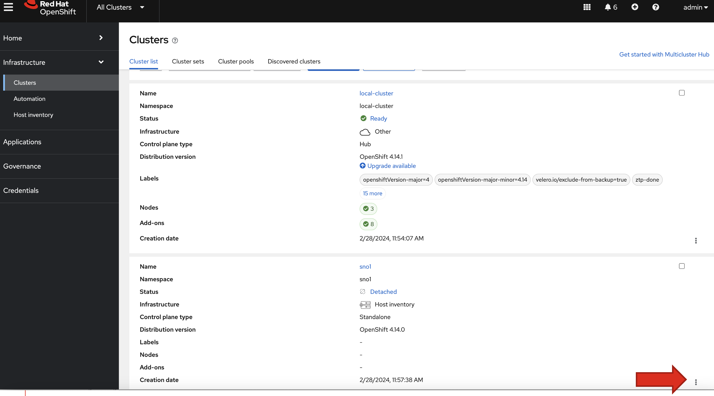
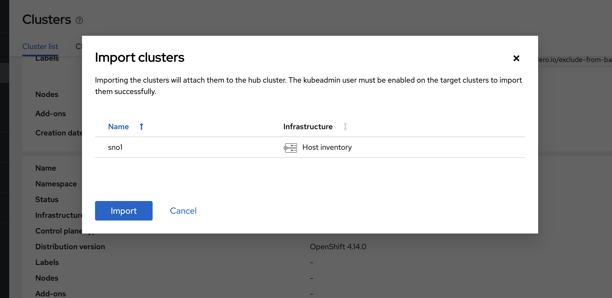
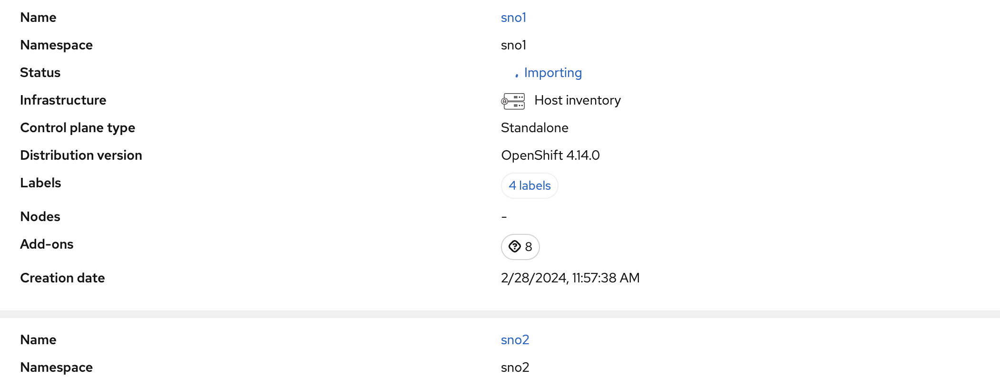

# Import SNO1

SNO1 is already deployed, but not yet managed by the Hub/Management Cluster's ACM. To import SNO1, go to ACM's GUI under `Infrastructure` , and then choose `Clusters`. From the GUI, choose the 3-dots in the section wheere SNO1 is listed: 


Choose the `import cluster` option, and the following popup will appear: 



Choose the `import` option from this screen. 

The cluster will now show as being imported: 



In a couple of minutes, the status will change to `Ready`. The cluster is now imported. 

you can also verify this on the command line as shown here: 

```
oc get managedclusters
```
> NAME&nbsp;&nbsp;&nbsp;&nbsp;&nbsp;&nbsp;&nbsp;&nbsp;&nbsp;&nbsp;&nbsp;&nbsp;HUB&nbsp;ACCEPTED&nbsp;&nbsp;&nbsp;MANAGED&nbsp;CLUSTER&nbsp;URLS&nbsp;&nbsp;&nbsp;&nbsp;&nbsp;&nbsp;&nbsp;&nbsp;&nbsp;&nbsp;&nbsp;&nbsp;&nbsp;&nbsp;&nbsp;&nbsp;&nbsp;&nbsp;&nbsp;&nbsp;&nbsp;&nbsp;JOINED&nbsp;&nbsp;&nbsp;AVAILABLE&nbsp;&nbsp;&nbsp;AGE<br>
> local-cluster&nbsp;&nbsp;&nbsp;true&nbsp;&nbsp;&nbsp;&nbsp;&nbsp;&nbsp;&nbsp;&nbsp;&nbsp;&nbsp;&nbsp;https://api.hub.5g-deployment.lab:6443 &nbsp;&nbsp;&nbsp;&nbsp;True&nbsp;&nbsp;&nbsp;&nbsp;&nbsp;True&nbsp;&nbsp;&nbsp;&nbsp;&nbsp;&nbsp;&nbsp;&nbsp;6h54m<br>
> sno1&nbsp;&nbsp;&nbsp;&nbsp;&nbsp;&nbsp;&nbsp;&nbsp;&nbsp;&nbsp;&nbsp;&nbsp;true&nbsp;&nbsp;&nbsp;&nbsp;&nbsp;&nbsp;&nbsp;&nbsp;&nbsp;&nbsp;&nbsp;https://api.sno1.5g-deployment.lab:6443 &nbsp;&nbsp;&nbsp;True&nbsp;&nbsp;&nbsp;&nbsp;&nbsp;True&nbsp;&nbsp;&nbsp;&nbsp;&nbsp;&nbsp;&nbsp;&nbsp;98s<br>
> sno2&nbsp;&nbsp;&nbsp;&nbsp;&nbsp;&nbsp;&nbsp;&nbsp;&nbsp;&nbsp;&nbsp;&nbsp;true&nbsp;&nbsp;&nbsp;&nbsp;&nbsp;&nbsp;&nbsp;&nbsp;&nbsp;&nbsp;&nbsp;https://api.sno2.5g-deployment.lab:6443 &nbsp;&nbsp;&nbsp;True&nbsp;&nbsp;&nbsp;&nbsp;&nbsp;True&nbsp;&nbsp;&nbsp;&nbsp;&nbsp;&nbsp;&nbsp;&nbsp;3h<br>

### Download SNO1's kubecomfing: 

```
export cluster=sno1
oc get secret -n $cluster $cluster-admin-kubeconfig -o jsonpath='{.data.kubeconfig}' | base64 -d > ~/sno1-kubeconfig
```
