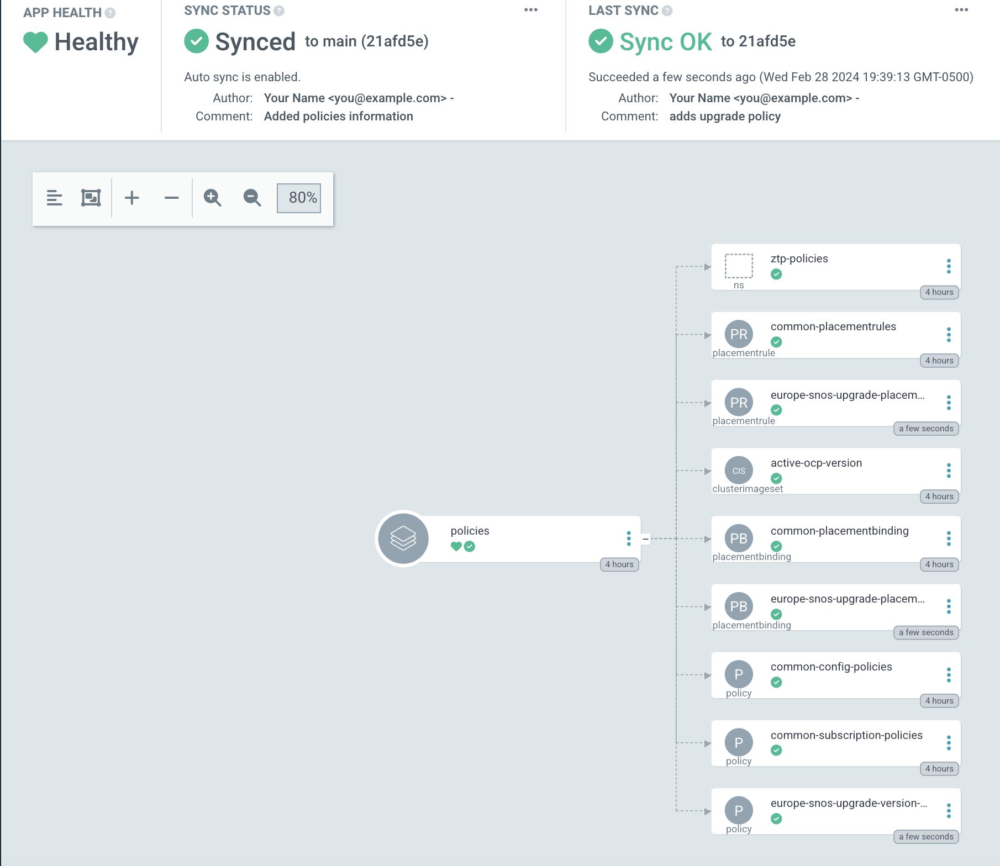
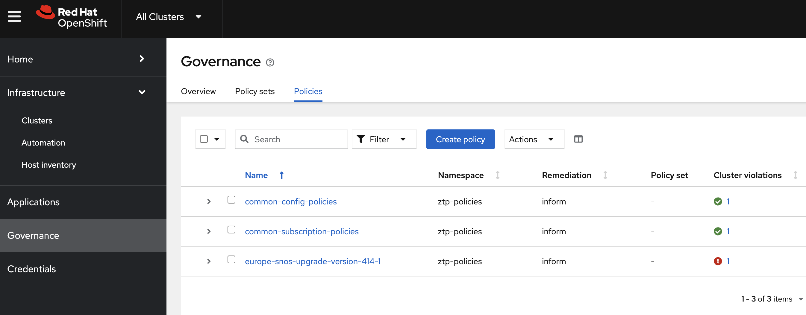
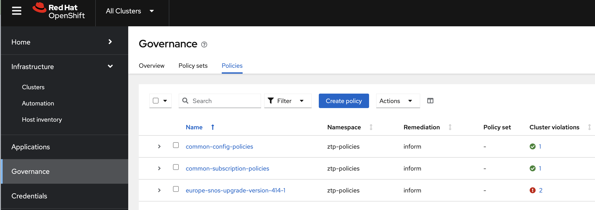

# Image Upgrade using TALM:

Start by creating a working directly for the upgrade. Lets call this directory `fleet`

```
mkdir ~/5g-deployment-lab/ztp-repository/policies/fleet
```

## Find image pointers: 

The lab image registry has already been populated with 14.4.1 OpenShift image. You can verify this by looking up the repository: 
```
podman exec -it registry ls -al /registry/docker/registry/v2/repositories/openshift/release-images/_manifests/tags/
```

> total&nbsp;16<br>
> drwxr-xr-x&nbsp;&nbsp;&nbsp;&nbsp;4&nbsp;root&nbsp;&nbsp;&nbsp;&nbsp;&nbsp;root&nbsp;&nbsp;&nbsp;&nbsp;&nbsp;&nbsp;&nbsp;&nbsp;&nbsp;&nbsp;4096&nbsp;Feb&nbsp;28&nbsp;16:05&nbsp;.<br>
> drwxr-xr-x&nbsp;&nbsp;&nbsp;&nbsp;4&nbsp;root&nbsp;&nbsp;&nbsp;&nbsp;&nbsp;root&nbsp;&nbsp;&nbsp;&nbsp;&nbsp;&nbsp;&nbsp;&nbsp;&nbsp;&nbsp;4096&nbsp;Feb&nbsp;28&nbsp;16:01&nbsp;..<br>
> drwxr-xr-x&nbsp;&nbsp;&nbsp;&nbsp;4&nbsp;root&nbsp;&nbsp;&nbsp;&nbsp;&nbsp;root&nbsp;&nbsp;&nbsp;&nbsp;&nbsp;&nbsp;&nbsp;&nbsp;&nbsp;&nbsp;4096&nbsp;Feb&nbsp;28&nbsp;16:05&nbsp;4.14.0-x86_64<br>
> drwxr-xr-x&nbsp;&nbsp;&nbsp;&nbsp;4&nbsp;root&nbsp;&nbsp;&nbsp;&nbsp;&nbsp;root&nbsp;&nbsp;&nbsp;&nbsp;&nbsp;&nbsp;&nbsp;&nbsp;&nbsp;&nbsp;4096&nbsp;Feb&nbsp;28&nbsp;16:01&nbsp;**4.14.1-x86_64**<br>

You can now optain the sha256 link to this as shown here: 
```
podman exec -it registry cat  /registry/docker/registry/v2/repositories/openshift/release-images/_manifests/tags/4.14.1-x86_64/current/link
```

> sha256:05ba8e63f8a76e568afe87f182334504a01d47342b6ad5b4c3ff83a2463018bd

## Define PGT for upgrade: 

Using this image pointer, define the image upgrade PGT manifest as shown here: 

```
cat << EOF > ~/5g-deployment-lab/ztp-repository/policies/fleet/zone-europe-upgrade-414-1.yaml
---
apiVersion: ran.openshift.io/v1
kind: PolicyGenTemplate
metadata:
  name: "europe-snos-upgrade"
  namespace: "ztp-policies"
spec:
  bindingRules:
    du-zone: "europe"
    logicalGroup: "active"
  mcp: "master"
  remediationAction: inform
  sourceFiles:
    - fileName: ClusterVersion.yaml
      policyName: "version-414-1"
      metadata:
        name: version
      spec:
        channel: "stable-4.14"
        desiredUpdate:
          force: false
          version: "4.14.1"
          image: "infra.5g-deployment.lab:8443/openshift/release-images@sha256:05ba8e63f8a76e568afe87f182334504a01d47342b6ad5b4c3ff83a2463018bd"
      status:
        history:
          - version: "4.14.1"
            state: "Completed"
EOF
```

This manifest using a pre-existing soure-cr that is defined [here](https://github.com/openshift-kni/cnf-features-deploy/blob/master/ztp/source-crs/ClusterVersion.yaml)

## Apply the Upgrade PGT: 

Add the upgrade CR to the local kustomization file, as well as a pointer to this directory in the top level kustomization file: 

```
cat << EOF > ~/5g-deployment-lab/ztp-repository/policies/fleet/kustomization.yaml
apiVersion: kustomize.config.k8s.io/v1beta1
kind: Kustomization
generators:
- zone-europe-upgrade-414-1.yaml
EOF
```

```
echo "- fleet" >> ~/5g-deployment-lab/ztp-repository/policies/kustomization.yaml
```

Add these changes to the Git repository: 

```
cd ~/5g-deployment-lab/ztp-repository/
git add .
git commit -m "adds upgrade policy"
git push
```

### Viewing rendered policy manifests on GUI:

The PGT will result in the three manfists for the CRs , as defined by the ZTP plugin. This can be viewed on the OpenShift GitOps GUI, as shown here: 

**NOTE** you may have to press `Refresh` instead of waiting for the new sync with Git to take place. 



### Checking Policy Applicability for Upgrade:

As Git is our single source of truth, this CR will get picked up and applied to the cluster that match the clusters that meet the match creiteria. 
The PGT had: 

> &nbsp;&nbsp;bindingRules:<br>
> &nbsp;&nbsp;&nbsp;&nbsp;du-zone:&nbsp;"europe"<br>
> &nbsp;&nbsp;&nbsp;&nbsp;logicalGroup:&nbsp;"active"<br>

Therefore the managed cluster(s) that have either of these labels will be upgraed. Lets take a look at the managed clusters: 
```
oc get managedclusters -l du-zone=europe
```
> NAME&nbsp;&nbsp;&nbsp;HUB&nbsp;ACCEPTED&nbsp;&nbsp;&nbsp;MANAGED&nbsp;CLUSTER&nbsp;URLS&nbsp;&nbsp;&nbsp;&nbsp;&nbsp;&nbsp;&nbsp;&nbsp;&nbsp;&nbsp;&nbsp;&nbsp;&nbsp;&nbsp;&nbsp;&nbsp;&nbsp;&nbsp;&nbsp;&nbsp;&nbsp;&nbsp;JOINED&nbsp;&nbsp;&nbsp;AVAILABLE&nbsp;&nbsp;&nbsp;AGE<br>
> sno2&nbsp;&nbsp;&nbsp;true&nbsp;&nbsp;&nbsp;&nbsp;&nbsp;&nbsp;&nbsp;&nbsp;&nbsp;&nbsp;&nbsp;https://api.sno2.5g-deployment.lab:6443 &nbsp;&nbsp;&nbsp;True&nbsp;&nbsp;&nbsp;&nbsp;&nbsp;True&nbsp;&nbsp;&nbsp;&nbsp;&nbsp;&nbsp;&nbsp;&nbsp;3h41m<br>

```
oc get managedclusters -l logicalGroup=active
```
> NAME&nbsp;&nbsp;&nbsp;HUB&nbsp;ACCEPTED&nbsp;&nbsp;&nbsp;MANAGED&nbsp;CLUSTER&nbsp;URLS&nbsp;&nbsp;&nbsp;&nbsp;&nbsp;&nbsp;&nbsp;&nbsp;&nbsp;&nbsp;&nbsp;&nbsp;&nbsp;&nbsp;&nbsp;&nbsp;&nbsp;&nbsp;&nbsp;&nbsp;&nbsp;&nbsp;JOINED&nbsp;&nbsp;&nbsp;AVAILABLE&nbsp;&nbsp;&nbsp;AGE<br>
> sno2&nbsp;&nbsp;&nbsp;true&nbsp;&nbsp;&nbsp;&nbsp;&nbsp;&nbsp;&nbsp;&nbsp;&nbsp;&nbsp;&nbsp;https://api.sno2.5g-deployment.lab:6443 &nbsp;&nbsp;&nbsp;True&nbsp;&nbsp;&nbsp;&nbsp;&nbsp;True&nbsp;&nbsp;&nbsp;&nbsp;&nbsp;&nbsp;&nbsp;&nbsp;3h42m<br>

So in both cases, only SNO2 will be upgraded while SNO1 doesn't match any of the binding labels. 

### Check status of policy: 

Check the status of the upgrade policy:

```
oc get policy -A
```
> NAMESPACE&nbsp;&nbsp;&nbsp;&nbsp;&nbsp;&nbsp;NAME&nbsp;&nbsp;&nbsp;&nbsp;&nbsp;&nbsp;&nbsp;&nbsp;&nbsp;&nbsp;&nbsp;&nbsp;&nbsp;&nbsp;&nbsp;&nbsp;&nbsp;&nbsp;&nbsp;&nbsp;&nbsp;&nbsp;&nbsp;&nbsp;&nbsp;&nbsp;&nbsp;&nbsp;&nbsp;&nbsp;&nbsp;&nbsp;&nbsp;&nbsp;&nbsp;&nbsp;&nbsp;&nbsp;&nbsp;&nbsp;&nbsp;&nbsp;&nbsp;&nbsp;&nbsp;REMEDIATION&nbsp;ACTION&nbsp;&nbsp;&nbsp;COMPLIANCE&nbsp;STATE&nbsp;&nbsp;&nbsp;AGE<br>   
> sno2&nbsp;&nbsp;&nbsp;&nbsp;&nbsp;&nbsp;&nbsp;&nbsp;&nbsp;&nbsp;&nbsp;ztp-policies.common-config-policies&nbsp;&nbsp;&nbsp;&nbsp;&nbsp;&nbsp;&nbsp;&nbsp;&nbsp;&nbsp;&nbsp;&nbsp;&nbsp;&nbsp;inform&nbsp;&nbsp;&nbsp;&nbsp;&nbsp;&nbsp;&nbsp;&nbsp;&nbsp;&nbsp;&nbsp;&nbsp;&nbsp;&nbsp;&nbsp;Compliant&nbsp;&nbsp;&nbsp;&nbsp;&nbsp;&nbsp;&nbsp;&nbsp;&nbsp;&nbsp;8h<br>
> sno2&nbsp;&nbsp;&nbsp;&nbsp;&nbsp;&nbsp;&nbsp;&nbsp;&nbsp;&nbsp;&nbsp;ztp-policies.common-subscription-policies&nbsp;&nbsp;&nbsp;&nbsp;&nbsp;&nbsp;&nbsp;&nbsp;inform&nbsp;&nbsp;&nbsp;&nbsp;&nbsp;&nbsp;&nbsp;&nbsp;&nbsp;&nbsp;&nbsp;&nbsp;&nbsp;&nbsp;&nbsp;Compliant&nbsp;&nbsp;&nbsp;&nbsp;&nbsp;&nbsp;&nbsp;&nbsp;&nbsp;&nbsp;8h<br>
> **sno2&nbsp;&nbsp;&nbsp;&nbsp;&nbsp;&nbsp;&nbsp;&nbsp;&nbsp;&nbsp;&nbsp;ztp-policies.europe-snos-upgrade-version-414-1&nbsp;&nbsp;&nbsp;inform&nbsp;&nbsp;&nbsp;&nbsp;&nbsp;&nbsp;&nbsp;&nbsp;&nbsp;&nbsp;&nbsp;&nbsp;&nbsp;&nbsp;&nbsp;NonCompliant&nbsp;&nbsp;&nbsp;&nbsp;&nbsp;&nbsp;&nbsp;116s**<br>
> ztp-policies&nbsp;&nbsp;&nbsp;common-config-policies&nbsp;&nbsp;&nbsp;&nbsp;&nbsp;&nbsp;&nbsp;&nbsp;&nbsp;&nbsp;&nbsp;&nbsp;&nbsp;&nbsp;&nbsp;&nbsp;&nbsp;&nbsp;&nbsp;&nbsp;&nbsp;&nbsp;&nbsp;&nbsp;&nbsp;&nbsp;&nbsp;inform&nbsp;&nbsp;&nbsp;&nbsp;&nbsp;&nbsp;&nbsp;&nbsp;&nbsp;&nbsp;&nbsp;&nbsp;&nbsp;&nbsp;&nbsp;Compliant&nbsp;&nbsp;&nbsp;&nbsp;&nbsp;&nbsp;&nbsp;&nbsp;&nbsp;&nbsp;8h<br>
> ztp-policies&nbsp;&nbsp;&nbsp;common-subscription-policies&nbsp;&nbsp;&nbsp;&nbsp;&nbsp;&nbsp;&nbsp;&nbsp;&nbsp;&nbsp;&nbsp;&nbsp;&nbsp;&nbsp;&nbsp;&nbsp;&nbsp;&nbsp;&nbsp;&nbsp;&nbsp;inform&nbsp;&nbsp;&nbsp;&nbsp;&nbsp;&nbsp;&nbsp;&nbsp;&nbsp;&nbsp;&nbsp;&nbsp;&nbsp;&nbsp;&nbsp;Compliant&nbsp;&nbsp;&nbsp;&nbsp;&nbsp;&nbsp;&nbsp;&nbsp;&nbsp;&nbsp;8h<br>
> ztp-policies&nbsp;&nbsp;&nbsp;europe-snos-upgrade-version-414-1&nbsp;&nbsp;&nbsp;&nbsp;&nbsp;&nbsp;&nbsp;&nbsp;&nbsp;&nbsp;&nbsp;&nbsp;&nbsp;&nbsp;&nbsp;&nbsp;inform&nbsp;&nbsp;&nbsp;&nbsp;&nbsp;&nbsp;&nbsp;&nbsp;&nbsp;&nbsp;&nbsp;&nbsp;&nbsp;&nbsp;&nbsp;NonCompliant&nbsp;&nbsp;&nbsp;&nbsp;&nbsp;&nbsp;&nbsp;116s<br>

Lets check the reason for non-compliance of this policy: 

```
oc get policy -n sno2 ztp-policies.europe-snos-upgrade-version-414-1 -o jsonpath={.status.details} | jq
```

> [<br>
> &nbsp;&nbsp;{<br>
> &nbsp;&nbsp;&nbsp;&nbsp;"compliant":&nbsp;"NonCompliant",<br>
> &nbsp;&nbsp;&nbsp;&nbsp;"history":&nbsp;[<br>
> &nbsp;&nbsp;&nbsp;&nbsp;&nbsp;&nbsp;{<br>
> &nbsp;&nbsp;&nbsp;&nbsp;&nbsp;&nbsp;&nbsp;&nbsp;"eventName":&nbsp;"ztp-policies.europe-snos-upgrade-version-414-1.17b7dbafebcf958b",<br>  
> &nbsp;&nbsp;&nbsp;&nbsp;&nbsp;&nbsp;&nbsp;&nbsp;"lastTimestamp":&nbsp;"2024-02-27T23:22:12Z",<br>
> &nbsp;&nbsp;&nbsp;&nbsp;&nbsp;&nbsp;&nbsp;&nbsp;**"message":&nbsp;"NonCompliant;&nbsp;violation&nbsp;-&nbsp;clusterversions&nbsp;[version]&nbsp;found&nbsp;but&nbsp;not&nbsp;as&nbsp;specified"**<br>
> &nbsp;&nbsp;&nbsp;&nbsp;&nbsp;&nbsp;}<br>
> &nbsp;&nbsp;&nbsp;&nbsp;],<br>
> &nbsp;&nbsp;&nbsp;&nbsp;"templateMeta":&nbsp;{<br>
> &nbsp;&nbsp;&nbsp;&nbsp;&nbsp;&nbsp;"creationTimestamp":&nbsp;null,<br>
> &nbsp;&nbsp;&nbsp;&nbsp;&nbsp;&nbsp;"name":&nbsp;"europe-snos-upgrade-version-414-1-config"<br>
> &nbsp;&nbsp;&nbsp;&nbsp;}<br>
> &nbsp;&nbsp;}<br>
> ]<br>

This is because the version found on the cluster is not matching 14.4.1. Thats expected becaue the cluster's current version is not 14.4.1. To find sno2's current version, use: 

```
oc get clusterversion --kubeconfig /root/sno2-kubeconfig 
```
p;&nbsp;&nbsp;STATUS<br>
> version&nbsp;&nbsp;&nbsp;4.14.0&nbsp;&nbsp;&nbsp;&nbsp;True&nbsp;&nbsp;&nbsp;&nbsp;&nbsp;&nbsp;&nbsp;&nbsp;False&nbsp;&nbsp;&nbsp;&nbsp;&nbsp;&nbsp;&nbsp;&nbsp;&nbsp;3h11m&nbsp;&nbsp;&nbsp;Cluster&nbsp;version&nbsp;is&nbsp;**4.14.0**<br>

The non-compliance of the policy can also be viewed 

This nonciiance is also visible on the GUI: 



### Include SNO1 for upgrade

Add one (or all) of the lables to sno1 as well, so its also marked for upgrade: 

```
oc label managedcluster sno1 logicalGroup=active
```
> managedcluster.cluster.open-cluster-management.io/sno1 labeled

Verify that sno1 now matches on this label:

```
oc get managedclusters -l logicalGroup=active
```

> NAME&nbsp;&nbsp;&nbsp;HUB&nbsp;ACCEPTED&nbsp;&nbsp;&nbsp;MANAGED&nbsp;CLUSTER&nbsp;URLS&nbsp;&nbsp;&nbsp;&nbsp;&nbsp;&nbsp;&nbsp;&nbsp;&nbsp;&nbsp;&nbsp;&nbsp;&nbsp;&nbsp;&nbsp;&nbsp;&nbsp;&nbsp;&nbsp;&nbsp;&nbsp;&nbsp;JOINED&nbsp;&nbsp;&nbsp;AVAILABLE&nbsp;&nbsp;&nbsp;AGE<br>       
> sno1&nbsp;&nbsp;&nbsp;true&nbsp;&nbsp;&nbsp;&nbsp;&nbsp;&nbsp;&nbsp;&nbsp;&nbsp;&nbsp;&nbsp;https://api.sno1.5g-deployment.lab:6443 &nbsp;&nbsp;&nbsp;True&nbsp;&nbsp;&nbsp;&nbsp;&nbsp;True&nbsp;&nbsp;&nbsp;&nbsp;&nbsp;&nbsp;&nbsp;&nbsp;61m<br>
> sno2&nbsp;&nbsp;&nbsp;true&nbsp;&nbsp;&nbsp;&nbsp;&nbsp;&nbsp;&nbsp;&nbsp;&nbsp;&nbsp;&nbsp;https://api.sno2.5g-deployment.lab:6443 &nbsp;&nbsp;&nbsp;True&nbsp;&nbsp;&nbsp;&nbsp;&nbsp;True&nbsp;&nbsp;&nbsp;&nbsp;&nbsp;&nbsp;&nbsp;&nbsp;3h59m<br>

Now lets take a look at the policies, and see if SNO1 has now been matched: 


```
oc get policy -A 
```

> NAMESPACE&nbsp;&nbsp;&nbsp;&nbsp;&nbsp;&nbsp;NAME&nbsp;&nbsp;&nbsp;&nbsp;&nbsp;&nbsp;&nbsp;&nbsp;&nbsp;&nbsp;&nbsp;&nbsp;&nbsp;&nbsp;&nbsp;&nbsp;&nbsp;&nbsp;&nbsp;&nbsp;&nbsp;&nbsp;&nbsp;&nbsp;&nbsp;&nbsp;&nbsp;&nbsp;&nbsp;&nbsp;&nbsp;&nbsp;&nbsp;&nbsp;&nbsp;&nbsp;&nbsp;&nbsp;&nbsp;&nbsp;REMEDIATION&nbsp;ACTION&nbsp;&nbsp;&nbsp;COMPLIANCE&nbsp;STATE&nbsp;&nbsp;&nbsp;AGE<br>
> sno2&nbsp;&nbsp;&nbsp;&nbsp;&nbsp;&nbsp;&nbsp;&nbsp;&nbsp;&nbsp;&nbsp;ztp-policies.common-config-policies&nbsp;&nbsp;&nbsp;&nbsp;&nbsp;&nbsp;&nbsp;&nbsp;&nbsp;inform&nbsp;&nbsp;&nbsp;&nbsp;&nbsp;&nbsp;&nbsp;&nbsp;&nbsp;&nbsp;&nbsp;&nbsp;&nbsp;&nbsp;&nbsp;Compliant&nbsp;&nbsp;&nbsp;&nbsp;&nbsp;&nbsp;&nbsp;&nbsp;&nbsp;&nbsp;12h<br>
> sno2&nbsp;&nbsp;&nbsp;&nbsp;&nbsp;&nbsp;&nbsp;&nbsp;&nbsp;&nbsp;&nbsp;ztp-policies.common-subscription-policies&nbsp;&nbsp;&nbsp;inform&nbsp;&nbsp;&nbsp;&nbsp;&nbsp;&nbsp;&nbsp;&nbsp;&nbsp;&nbsp;&nbsp;&nbsp;&nbsp;&nbsp;&nbsp;Compliant&nbsp;&nbsp;&nbsp;&nbsp;&nbsp;&nbsp;&nbsp;&nbsp;&nbsp;&nbsp;3h50m<br>
> ztp-policies&nbsp;&nbsp;&nbsp;common-config-policies&nbsp;&nbsp;&nbsp;&nbsp;&nbsp;&nbsp;&nbsp;&nbsp;&nbsp;&nbsp;&nbsp;&nbsp;&nbsp;&nbsp;&nbsp;&nbsp;&nbsp;&nbsp;&nbsp;&nbsp;&nbsp;&nbsp;inform&nbsp;&nbsp;&nbsp;&nbsp;&nbsp;&nbsp;&nbsp;&nbsp;&nbsp;&nbsp;&nbsp;&nbsp;&nbsp;&nbsp;&nbsp;Compliant&nbsp;&nbsp;&nbsp;&nbsp;&nbsp;&nbsp;&nbsp;&nbsp;&nbsp;&nbsp;12h<br>
> ztp-policies&nbsp;&nbsp;&nbsp;common-subscription-policies&nbsp;&nbsp;&nbsp;&nbsp;&nbsp;&nbsp;&nbsp;&nbsp;&nbsp;&nbsp;&nbsp;&nbsp;&nbsp;&nbsp;&nbsp;&nbsp;inform&nbsp;&nbsp;&nbsp;&nbsp;&nbsp;&nbsp;&nbsp;&nbsp;&nbsp;&nbsp;&nbsp;&nbsp;&nbsp;&nbsp;&nbsp;Compliant&nbsp;&nbsp;&nbsp;&nbsp;&nbsp;&nbsp;&nbsp;&nbsp;&nbsp;&nbsp;3h50m<br>

```
oc label managedcluster sno1 du-zone=europe
```

You can now view the policies, and find SNO1 included in the list: 

**NOTE** This also shows that the binding labels are logically AND, and hence all of the labels need to match for a binding to be in place

```
oc get policy -A 
```

> NAMESPACE&nbsp;&nbsp;&nbsp;&nbsp;&nbsp;&nbsp;NAME&nbsp;&nbsp;&nbsp;&nbsp;&nbsp;&nbsp;&nbsp;&nbsp;&nbsp;&nbsp;&nbsp;&nbsp;&nbsp;&nbsp;&nbsp;&nbsp;&nbsp;&nbsp;&nbsp;&nbsp;&nbsp;&nbsp;&nbsp;&nbsp;&nbsp;&nbsp;&nbsp;&nbsp;&nbsp;&nbsp;&nbsp;&nbsp;&nbsp;&nbsp;&nbsp;&nbsp;&nbsp;&nbsp;&nbsp;&nbsp;&nbsp;&nbsp;&nbsp;&nbsp;&nbsp;REMEDIATION&nbsp;ACTION&nbsp;&nbsp;&nbsp;COMPLIANCE&nbsp;STATE&nbsp;&nbsp;&nbsp;AGE<br>   
> sno1&nbsp;&nbsp;&nbsp;&nbsp;&nbsp;&nbsp;&nbsp;&nbsp;&nbsp;&nbsp;&nbsp;ztp-policies.europe-snos-upgrade-version-414-1&nbsp;&nbsp;&nbsp;inform&nbsp;&nbsp;&nbsp;&nbsp;&nbsp;&nbsp;&nbsp;&nbsp;&nbsp;&nbsp;&nbsp;&nbsp;&nbsp;&nbsp;&nbsp;&nbsp;&nbsp;&nbsp;&nbsp;&nbsp;&nbsp;&nbsp;&nbsp;&nbsp;&nbsp;&nbsp;&nbsp;&nbsp;&nbsp;&nbsp;&nbsp;&nbsp;&nbsp;&nbsp;2m1s<br>
> sno2&nbsp;&nbsp;&nbsp;&nbsp;&nbsp;&nbsp;&nbsp;&nbsp;&nbsp;&nbsp;&nbsp;ztp-policies.common-config-policies&nbsp;&nbsp;&nbsp;&nbsp;&nbsp;&nbsp;&nbsp;&nbsp;&nbsp;&nbsp;&nbsp;&nbsp;&nbsp;&nbsp;inform&nbsp;&nbsp;&nbsp;&nbsp;&nbsp;&nbsp;&nbsp;&nbsp;&nbsp;&nbsp;&nbsp;&nbsp;&nbsp;&nbsp;&nbsp;Compliant&nbsp;&nbsp;&nbsp;&nbsp;&nbsp;&nbsp;&nbsp;&nbsp;&nbsp;&nbsp;12h<br>
> sno2&nbsp;&nbsp;&nbsp;&nbsp;&nbsp;&nbsp;&nbsp;&nbsp;&nbsp;&nbsp;&nbsp;ztp-policies.common-subscription-policies&nbsp;&nbsp;&nbsp;&nbsp;&nbsp;&nbsp;&nbsp;&nbsp;inform&nbsp;&nbsp;&nbsp;&nbsp;&nbsp;&nbsp;&nbsp;&nbsp;&nbsp;&nbsp;&nbsp;&nbsp;&nbsp;&nbsp;&nbsp;Compliant&nbsp;&nbsp;&nbsp;&nbsp;&nbsp;&nbsp;&nbsp;&nbsp;&nbsp;&nbsp;12h<br>
> sno2&nbsp;&nbsp;&nbsp;&nbsp;&nbsp;&nbsp;&nbsp;&nbsp;&nbsp;&nbsp;&nbsp;ztp-policies.europe-snos-upgrade-version-414-1&nbsp;&nbsp;&nbsp;inform&nbsp;&nbsp;&nbsp;&nbsp;&nbsp;&nbsp;&nbsp;&nbsp;&nbsp;&nbsp;&nbsp;&nbsp;&nbsp;&nbsp;&nbsp;NonCompliant&nbsp;&nbsp;&nbsp;&nbsp;&nbsp;&nbsp;&nbsp;3h43m<br>
> ztp-policies&nbsp;&nbsp;&nbsp;common-config-policies&nbsp;&nbsp;&nbsp;&nbsp;&nbsp;&nbsp;&nbsp;&nbsp;&nbsp;&nbsp;&nbsp;&nbsp;&nbsp;&nbsp;&nbsp;&nbsp;&nbsp;&nbsp;&nbsp;&nbsp;&nbsp;&nbsp;&nbsp;&nbsp;&nbsp;&nbsp;&nbsp;inform&nbsp;&nbsp;&nbsp;&nbsp;&nbsp;&nbsp;&nbsp;&nbsp;&nbsp;&nbsp;&nbsp;&nbsp;&nbsp;&nbsp;&nbsp;Compliant&nbsp;&nbsp;&nbsp;&nbsp;&nbsp;&nbsp;&nbsp;&nbsp;&nbsp;&nbsp;12h<br>
> ztp-policies&nbsp;&nbsp;&nbsp;common-subscription-policies&nbsp;&nbsp;&nbsp;&nbsp;&nbsp;&nbsp;&nbsp;&nbsp;&nbsp;&nbsp;&nbsp;&nbsp;&nbsp;&nbsp;&nbsp;&nbsp;&nbsp;&nbsp;&nbsp;&nbsp;&nbsp;inform&nbsp;&nbsp;&nbsp;&nbsp;&nbsp;&nbsp;&nbsp;&nbsp;&nbsp;&nbsp;&nbsp;&nbsp;&nbsp;&nbsp;&nbsp;Compliant&nbsp;&nbsp;&nbsp;&nbsp;&nbsp;&nbsp;&nbsp;&nbsp;&nbsp;&nbsp;12h<br>
> ztp-policies&nbsp;&nbsp;&nbsp;europe-snos-upgrade-version-414-1&nbsp;&nbsp;&nbsp;&nbsp;&nbsp;&nbsp;&nbsp;&nbsp;&nbsp;&nbsp;&nbsp;&nbsp;&nbsp;&nbsp;&nbsp;&nbsp;inform&nbsp;&nbsp;&nbsp;&nbsp;&nbsp;&nbsp;&nbsp;&nbsp;&nbsp;&nbsp;&nbsp;&nbsp;&nbsp;&nbsp;&nbsp;NonCompliant&nbsp;&nbsp;&nbsp;&nbsp;&nbsp;&nbsp;&nbsp;3h43m<br>

The violations (due to non-compliance) can also be viewed on the GUI, as the count has now gone up from 1 to 2:



As the upgrade policy is a day2 policy, it will need a manual CGU to be created. However, lets create the CGU in next step.

### Creating a the CGU for upgrade:

To creat this CGU, use the following. Note that the CGU is being defined as disabled (`enable: false`). Thats because we don't want to kick off the upgrade just yet. 

```
cat << EOF | oc apply -f - 
apiVersion: ran.openshift.io/v1alpha1
kind: ClusterGroupUpgrade
metadata:
  name: update-europe-snos
  namespace: ztp-policies
spec:
  preCaching: true
  preCachingConfigRef:
    name: update-europe-snos
    namespace: ztp-policies
  backup: true
  clusters:
  - sno1
  - sno2
  enable: false
  managedPolicies:
  - europe-snos-upgrade-version-414-1
  remediationStrategy:
    maxConcurrency: 2
    timeout: 240
EOF
```
> clustergroupupgrade.ran.openshift.io/update-europe-snos created

The CGU will get created, but it will compnain about the missing precaching configuration: 

```
oc get cgu -A
```

> NAMESPACE&nbsp;&nbsp;&nbsp;&nbsp;&nbsp;&nbsp;NAME&nbsp;&nbsp;&nbsp;&nbsp;&nbsp;&nbsp;&nbsp;&nbsp;&nbsp;&nbsp;&nbsp;&nbsp;&nbsp;&nbsp;&nbsp;&nbsp;&nbsp;AGE&nbsp;&nbsp;&nbsp;&nbsp;&nbsp;STATE&nbsp;&nbsp;&nbsp;&nbsp;&nbsp;&nbsp;&nbsp;&nbsp;&nbsp;&nbsp;&nbsp;&nbsp;&nbsp;&nbsp;&nbsp;&nbsp;&nbsp;&nbsp;&nbsp;&nbsp;DETAILS<br>
> ztp-install&nbsp;&nbsp;&nbsp;&nbsp;local-cluster&nbsp;&nbsp;&nbsp;&nbsp;&nbsp;&nbsp;&nbsp;&nbsp;9h&nbsp;&nbsp;&nbsp;&nbsp;&nbsp;&nbsp;Completed&nbsp;&nbsp;&nbsp;&nbsp;&nbsp;&nbsp;&nbsp;&nbsp;&nbsp;&nbsp;&nbsp;&nbsp;&nbsp;&nbsp;&nbsp;&nbsp;All&nbsp;clusters&nbsp;already&nbsp;compliant&nbsp;with&nbsp;the&nbsp;specified&nbsp;managed&nbsp;policies<br>
> ztp-install&nbsp;&nbsp;&nbsp;&nbsp;sno1&nbsp;&nbsp;&nbsp;&nbsp;&nbsp;&nbsp;&nbsp;&nbsp;&nbsp;&nbsp;&nbsp;&nbsp;&nbsp;&nbsp;&nbsp;&nbsp;&nbsp;132m&nbsp;&nbsp;&nbsp;&nbsp;Completed&nbsp;&nbsp;&nbsp;&nbsp;&nbsp;&nbsp;&nbsp;&nbsp;&nbsp;&nbsp;&nbsp;&nbsp;&nbsp;&nbsp;&nbsp;&nbsp;All&nbsp;clusters&nbsp;already&nbsp;compliant&nbsp;with&nbsp;the&nbsp;specified&nbsp;managed&nbsp;policies<br>
> ztp-install&nbsp;&nbsp;&nbsp;&nbsp;sno2&nbsp;&nbsp;&nbsp;&nbsp;&nbsp;&nbsp;&nbsp;&nbsp;&nbsp;&nbsp;&nbsp;&nbsp;&nbsp;&nbsp;&nbsp;&nbsp;&nbsp;4h37m&nbsp;&nbsp;&nbsp;Completed&nbsp;&nbsp;&nbsp;&nbsp;&nbsp;&nbsp;&nbsp;&nbsp;&nbsp;&nbsp;&nbsp;&nbsp;&nbsp;&nbsp;&nbsp;&nbsp;All&nbsp;clusters&nbsp;are&nbsp;compliant&nbsp;with&nbsp;all&nbsp;the&nbsp;managed&nbsp;policies<br>
> ztp-policies&nbsp;&nbsp;&nbsp;update-europe-snos&nbsp;&nbsp;&nbsp;7s&nbsp;&nbsp;&nbsp;&nbsp;&nbsp;&nbsp;PrecacheSpecIncomplete&nbsp;&nbsp;&nbsp;Precaching&nbsp;spec&nbsp;is&nbsp;incomplete:&nbsp;failed&nbsp;to&nbsp;get&nbsp;PreCachingConfig&nbsp;resource&nbsp;due&nbsp;to&nbsp;PreCachingConfig.ran.openshift.io&nbsp;"update-europe-snos"&nbsp;not&nbsp;found<br>

## Defining Pre-Caching Configuration:

The pre-caching configuraiton defines what gets pre-cached to make the upgrade more efficient and compliant to the maintenance window. 
We can configure that using the follwing: 

```
cat << EOF | oc apply -f -
---
apiVersion: ran.openshift.io/v1alpha1
kind: PreCachingConfig
metadata:
  name: update-europe-snos
  namespace: ztp-policies
spec:
  overrides: {}
  excludePrecachePatterns:
    - agent-installer-
    - alibaba-
    - aws-
    - azure-
    - cloud-
    - gcp-
    - ibmcloud
    - ibm-
    - nutanix-
    - openstack-
    - ovirt-
    - powervs-
    - sdn
    - vsphere-
    - kuryr-
    - csi-
    - hypershift
  additionalImages: []
EOF
```

you will see that pre-cachaing starts to take place: 


oc get cgu -A
NAMESPACE      NAME                 AGE     STATE        DETAILS
ztp-install    local-cluster        9h      Completed    All clusters already compliant with the specified managed policies
ztp-install    sno1                 142m    Completed    All clusters already compliant with the specified managed policies
ztp-install    sno2                 4h47m   Completed    All clusters are compliant with all the managed policies
ztp-policies   update-europe-snos   10m     InProgress   Precaching in progress for 2 clusters

> **NOTE** Pre-cache job can take up to 5m to be created.

### Monitor Pre-caching:

The pre-cahcing job is run on the target cluster. Lets monitor the job on SNO2: 

```
oc --kubeconfig ~/sno2-kubeconfig -n openshift-talo-pre-cache get job pre-cache
```
> NAME&nbsp;&nbsp;&nbsp;&nbsp;&nbsp;&nbsp;&nbsp;&nbsp;COMPLETIONS&nbsp;&nbsp;&nbsp;DURATION&nbsp;&nbsp;&nbsp;AGE<br>
> pre-cache&nbsp;&nbsp;&nbsp;0/1&nbsp;&nbsp;&nbsp;&nbsp;&nbsp;&nbsp;&nbsp;&nbsp;&nbsp;&nbsp;&nbsp;0s&nbsp;&nbsp;&nbsp;&nbsp;&nbsp;&nbsp;&nbsp;&nbsp;&nbsp;0s<br>

Take a look at the pod created by this job: 

```
oc --kubeconfig ~/sno2-kubeconfig -n openshift-talo-pre-cache get pods
```

> NAME&nbsp;&nbsp;&nbsp;&nbsp;&nbsp;&nbsp;&nbsp;&nbsp;&nbsp;&nbsp;&nbsp;&nbsp;&nbsp;&nbsp;READY&nbsp;&nbsp;&nbsp;STATUS&nbsp;&nbsp;&nbsp;&nbsp;RESTARTS&nbsp;&nbsp;&nbsp;AGE<br>
> pre-cache-k57l6&nbsp;&nbsp;&nbsp;1/1&nbsp;&nbsp;&nbsp;&nbsp;&nbsp;Running&nbsp;&nbsp;&nbsp;0&nbsp;&nbsp;&nbsp;&nbsp;&nbsp;&nbsp;&nbsp;&nbsp;&nbsp;&nbsp;26s<br>

Take a look at the logs from this pod: 

```
oc --kubeconfig ~/sno2-kubeconfig -n openshift-talo-pre-cache logs pre-cache-k57l6
```

> upgrades.pre-cache&nbsp;2024-02-29T02:11:12+00:00&nbsp;[DEBUG]:&nbsp;Pulling&nbsp;quay.io/openshift-release-dev/ocp-v4.0-art-dev@sha256:008349a3c6f2b5eaa14e7759defb41940e6c29a7b4144b40bdacef910c32500b&nbsp;[1/111]<br>
> upgrades.pre-cache&nbsp;2024-02-29T02:11:12+00:00&nbsp;[DEBUG]:&nbsp;Pulling&nbsp;quay.io/openshift-release-dev/ocp-v4.0-art-dev@sha256:039822e6e63cb7f29f51b1d51d39bfa380c81421834144b7cf96a890d5d982f9&nbsp;[2/111]<br>
> upgrades.pre-cache&nbsp;2024-02-29T02:11:12+00:00&nbsp;[DEBUG]:&nbsp;Skipping&nbsp;existing&nbsp;image&nbsp;quay.io/openshift-release-dev/ocp-v4.0-art-dev@sha256:039822e6e63cb7f29f51b1d51d39bfa380c81421834144b7cf96a890d5d982f9<br>
> upgrades.pre-cache&nbsp;2024-02-29T02:11:12+00:00&nbsp;[DEBUG]:&nbsp;Pulling&nbsp;quay.io/openshift-release-dev/ocp-v4.0-art-dev@sha256:0a1a2668f93bbe26be5706db8fe1a504e3a6b9857e8f91744f285b66f0b35531&nbsp;[3/111]<br>

After a few minutes, pre-caching will be complete, as can be seen by the CGU status: 

```
 oc get cgu -A
 ```

 > NAMESPACE&nbsp;&nbsp;&nbsp;&nbsp;&nbsp;&nbsp;NAME&nbsp;&nbsp;&nbsp;&nbsp;&nbsp;&nbsp;&nbsp;&nbsp;&nbsp;&nbsp;&nbsp;&nbsp;&nbsp;&nbsp;&nbsp;&nbsp;&nbsp;AGE&nbsp;&nbsp;&nbsp;&nbsp;&nbsp;STATE&nbsp;&nbsp;&nbsp;&nbsp;&nbsp;&nbsp;&nbsp;&nbsp;DETAILS<br>
> ztp-install&nbsp;&nbsp;&nbsp;&nbsp;local-cluster&nbsp;&nbsp;&nbsp;&nbsp;&nbsp;&nbsp;&nbsp;&nbsp;9h&nbsp;&nbsp;&nbsp;&nbsp;&nbsp;&nbsp;Completed&nbsp;&nbsp;&nbsp;&nbsp;All&nbsp;clusters&nbsp;already&nbsp;compliant&nbsp;with&nbsp;the&nbsp;specified&nbsp;managed&nbsp;policies<br>
> ztp-install&nbsp;&nbsp;&nbsp;&nbsp;sno1&nbsp;&nbsp;&nbsp;&nbsp;&nbsp;&nbsp;&nbsp;&nbsp;&nbsp;&nbsp;&nbsp;&nbsp;&nbsp;&nbsp;&nbsp;&nbsp;&nbsp;146m&nbsp;&nbsp;&nbsp;&nbsp;Completed&nbsp;&nbsp;&nbsp;&nbsp;All&nbsp;clusters&nbsp;already&nbsp;compliant&nbsp;with&nbsp;the&nbsp;specified&nbsp;managed&nbsp;policies<br>
> ztp-install&nbsp;&nbsp;&nbsp;&nbsp;sno2&nbsp;&nbsp;&nbsp;&nbsp;&nbsp;&nbsp;&nbsp;&nbsp;&nbsp;&nbsp;&nbsp;&nbsp;&nbsp;&nbsp;&nbsp;&nbsp;&nbsp;4h51m&nbsp;&nbsp;&nbsp;Completed&nbsp;&nbsp;&nbsp;&nbsp;All&nbsp;clusters&nbsp;are&nbsp;compliant&nbsp;with&nbsp;all&nbsp;the&nbsp;managed&nbsp;policies<br>
> ztp-policies&nbsp;&nbsp;&nbsp;update-europe-snos&nbsp;&nbsp;&nbsp;14m&nbsp;&nbsp;&nbsp;&nbsp;&nbsp;NotEnabled&nbsp;&nbsp;&nbsp;Not&nbsp;enabled<br>

Note that if you look for the pre-caching pod after the job is completed, you will not find the job or even the namespace existing anymore. 

### Check pre-cached images:

Just for information, we can check the cached images on the target cluster using the following steps: 

```
oc debug node/sno2.5g-deployment.lab --kubeconfig ~/sno2-kubeconfig 
```
>&nbsp;Starting&nbsp;pod/sno25g-deploymentlab-debug-jbx4h&nbsp;...<br>
>&nbsp;To&nbsp;use&nbsp;host&nbsp;binaries,&nbsp;run&nbsp;`chroot&nbsp;/host`<br>
>&nbsp;Pod&nbsp;IP:&nbsp;192.168.125.40<br>
>&nbsp;If&nbsp;you&nbsp;don't&nbsp;see&nbsp;a&nbsp;command&nbsp;prompt,&nbsp;try&nbsp;pressing&nbsp;enter.<br>
>&nbsp;sh-4.4#&nbsp;<br>

```
chroot /host
podman images | grep 5g
```

>&nbsp;infra.5g-deployment.lab:8443/redhat/redhat-operator-index&nbsp;&nbsp;&nbsp;&nbsp;&nbsp;&nbsp;&nbsp;&nbsp;&nbsp;&nbsp;&nbsp;&nbsp;&nbsp;&nbsp;&nbsp;&nbsp;&nbsp;&nbsp;&nbsp;&nbsp;&nbsp;&nbsp;v4.14-1700503430&nbsp;&nbsp;409db6e5b49f&nbsp;&nbsp;3&nbsp;months&nbsp;ago&nbsp;&nbsp;1.78&nbsp;GB<br>
>&nbsp;infra.5g-deployment.lab:8443/openshift/release-images&nbsp;&nbsp;&nbsp;&nbsp;&nbsp;&nbsp;&nbsp;&nbsp;&nbsp;&nbsp;&nbsp;&nbsp;&nbsp;&nbsp;&nbsp;&nbsp;&nbsp;&nbsp;&nbsp;&nbsp;&nbsp;&nbsp;&nbsp;&nbsp;&nbsp;&nbsp;<none>&nbsp;&nbsp;&nbsp;&nbsp;&nbsp;&nbsp;&nbsp;&nbsp;&nbsp;&nbsp;&nbsp;&nbsp;d3e740b44b78&nbsp;&nbsp;4&nbsp;months&nbsp;ago&nbsp;&nbsp;519&nbsp;MB<br>
>&nbsp;infra.5g-deployment.lab:8443/openshift/release-images&nbsp;&nbsp;&nbsp;&nbsp;&nbsp;&nbsp;&nbsp;&nbsp;&nbsp;&nbsp;&nbsp;&nbsp;&nbsp;&nbsp;&nbsp;&nbsp;&nbsp;&nbsp;&nbsp;&nbsp;&nbsp;&nbsp;&nbsp;&nbsp;&nbsp;&nbsp;<none>&nbsp;&nbsp;&nbsp;&nbsp;&nbsp;&nbsp;&nbsp;&nbsp;&nbsp;&nbsp;&nbsp;&nbsp;0c7cd234c0ea&nbsp;&nbsp;4&nbsp;months&nbsp;ago&nbsp;&nbsp;519&nbsp;MB<br>

### Triggering the upgrade: 

To finally trigger the upgrade, `enable` the CGU using the following command: 

```
oc patch cgu update-europe-snos -n ztp-policies --type merge --patch '{"spec":{"enable":true}}'
```

This will trigger the backup process before proceeding with the upgrade

### Monitoring backup process:

The backup job is created on the target cluster, and can be seen using: 

```
oc --kubeconfig ~/sno2-kubeconfig get job -n openshift-talo-backup
```

> NAME&nbsp;&nbsp;&nbsp;&nbsp;&nbsp;&nbsp;&nbsp;&nbsp;&nbsp;&nbsp;&nbsp;COMPLETIONS&nbsp;&nbsp;&nbsp;DURATION&nbsp;&nbsp;&nbsp;AGE<br>
> backup-agent&nbsp;&nbsp;&nbsp;0/1&nbsp;&nbsp;&nbsp;&nbsp;&nbsp;&nbsp;&nbsp;&nbsp;&nbsp;&nbsp;&nbsp;9s&nbsp;&nbsp;&nbsp;&nbsp;&nbsp;&nbsp;&nbsp;&nbsp;&nbsp;9s<br>


Find out the pod that this job created, using: 

> NAME&nbsp;&nbsp;&nbsp;&nbsp;&nbsp;&nbsp;&nbsp;&nbsp;&nbsp;&nbsp;&nbsp;&nbsp;&nbsp;&nbsp;&nbsp;&nbsp;&nbsp;READY&nbsp;&nbsp;&nbsp;STATUS&nbsp;&nbsp;&nbsp;&nbsp;RESTARTS&nbsp;&nbsp;&nbsp;AGE<br>
> backup-agent-fz5dg&nbsp;&nbsp;&nbsp;1/1&nbsp;&nbsp;&nbsp;&nbsp;&nbsp;Running&nbsp;&nbsp;&nbsp;0&nbsp;&nbsp;&nbsp;&nbsp;&nbsp;&nbsp;&nbsp;&nbsp;&nbsp;&nbsp;21s<br>


```
 oc --kubeconfig ~/sno2-kubeconfig get pods -n openshift-talo-backup
 ```

> INFO[0000]&nbsp;Successfully&nbsp;mounted&nbsp;/host/dev/shm&nbsp;&nbsp;&nbsp;&nbsp;&nbsp;&nbsp;&nbsp;&nbsp;&nbsp;&nbsp;&nbsp;<br>
> INFO[0000]&nbsp;Successfully&nbsp;remounted&nbsp;/host/sysroot&nbsp;with&nbsp;r/w&nbsp;permission&nbsp;<br>
> INFO[0000]&nbsp;Successfully&nbsp;renamed&nbsp;/run/ostree-booted&nbsp;to&nbsp;/run/ostree-booted.tmp&nbsp;<br>
> INFO[0000]&nbsp;------------------------------------------------------------&nbsp;<br>
> INFO[0000]&nbsp;Cleaning&nbsp;up&nbsp;old&nbsp;content...&nbsp;&nbsp;&nbsp;&nbsp;&nbsp;&nbsp;&nbsp;&nbsp;&nbsp;&nbsp;&nbsp;&nbsp;&nbsp;&nbsp;&nbsp;&nbsp;&nbsp;&nbsp;&nbsp;<br>
> INFO[0000]&nbsp;------------------------------------------------------------&nbsp;<br>
> INFO[0000]&nbsp;Old&nbsp;directories&nbsp;deleted&nbsp;with&nbsp;contents&nbsp;&nbsp;&nbsp;&nbsp;&nbsp;&nbsp;&nbsp;&nbsp;<br>
> INFO[0000]&nbsp;Old&nbsp;contents&nbsp;have&nbsp;been&nbsp;cleaned&nbsp;up&nbsp;&nbsp;&nbsp;&nbsp;&nbsp;&nbsp;&nbsp;&nbsp;&nbsp;&nbsp;&nbsp;&nbsp;<br>
> INFO[0004]&nbsp;Available&nbsp;disk&nbsp;space&nbsp;:&nbsp;159.76&nbsp;GiB;&nbsp;Estimated&nbsp;disk&nbsp;space&nbsp;required&nbsp;for&nbsp;backup:&nbsp;74.27&nbsp;GiB&nbsp;&nbsp;<br>
> INFO[0004]&nbsp;Sufficient&nbsp;disk&nbsp;space&nbsp;found&nbsp;to&nbsp;trigger&nbsp;backup&nbsp;<br>
> INFO[0004]&nbsp;Upgrade&nbsp;recovery&nbsp;script&nbsp;written&nbsp;&nbsp;&nbsp;&nbsp;&nbsp;&nbsp;&nbsp;&nbsp;&nbsp;&nbsp;&nbsp;&nbsp;&nbsp;&nbsp;<br>
> INFO[0004]&nbsp;Running:&nbsp;bash&nbsp;-c&nbsp;/var/recovery/upgrade-recovery.sh&nbsp;--take-backup&nbsp;--dir&nbsp;/var/recovery&nbsp;<br>
> INFO[0004]&nbsp;#####&nbsp;Thu&nbsp;Feb&nbsp;29&nbsp;02:24:57&nbsp;UTC&nbsp;2024:&nbsp;Taking&nbsp;backup&nbsp;<br>
> INFO[0004]&nbsp;#####&nbsp;Thu&nbsp;Feb&nbsp;29&nbsp;02:24:57&nbsp;UTC&nbsp;2024:&nbsp;Wiping&nbsp;previous&nbsp;deployments&nbsp;and&nbsp;pinning&nbsp;active&nbsp;<br>
>


The logs of this pod will give an idea about the status of the backup process:

```
oc --kubeconfig ~/sno2-kubeconfig logs -n openshift-talo-backup backup-agent-fz5dg
```

> NAME&nbsp;&nbsp;&nbsp;&nbsp;&nbsp;&nbsp;&nbsp;&nbsp;&nbsp;&nbsp;&nbsp;&nbsp;&nbsp;&nbsp;&nbsp;&nbsp;&nbsp;AGE&nbsp;&nbsp;&nbsp;STATE&nbsp;&nbsp;&nbsp;&nbsp;&nbsp;&nbsp;&nbsp;&nbsp;DETAILS<br>
> update-europe-snos&nbsp;&nbsp;&nbsp;26m&nbsp;&nbsp;&nbsp;InProgress&nbsp;&nbsp;&nbsp;Remediating&nbsp;non-compliant&nbsp;policies<br>


Once backup is completed, the logs will indicate that, and also CGU will move to the status `BackupCompleted`. Soon after CGU will start to show the status `InProgress`

```
oc get cgu -n ztp-policies
```

> -----<br>
> NAMESPACE&nbsp;&nbsp;&nbsp;&nbsp;&nbsp;&nbsp;NAME&nbsp;&nbsp;&nbsp;&nbsp;&nbsp;&nbsp;&nbsp;&nbsp;&nbsp;&nbsp;&nbsp;&nbsp;&nbsp;&nbsp;&nbsp;&nbsp;&nbsp;&nbsp;&nbsp;&nbsp;&nbsp;&nbsp;&nbsp;&nbsp;&nbsp;&nbsp;&nbsp;&nbsp;&nbsp;&nbsp;&nbsp;&nbsp;&nbsp;&nbsp;&nbsp;&nbsp;&nbsp;&nbsp;&nbsp;&nbsp;&nbsp;&nbsp;&nbsp;&nbsp;&nbsp;REMEDIATION&nbsp;ACTION&nbsp;&nbsp;&nbsp;COMPLIANCE&nbsp;STATE&nbsp;&nbsp;&nbsp;AGE<br>
> sno1&nbsp;&nbsp;&nbsp;&nbsp;&nbsp;&nbsp;&nbsp;&nbsp;&nbsp;&nbsp;&nbsp;ztp-policies.europe-snos-upgrade-version-414-1&nbsp;&nbsp;&nbsp;inform&nbsp;&nbsp;&nbsp;&nbsp;&nbsp;&nbsp;&nbsp;&nbsp;&nbsp;&nbsp;&nbsp;&nbsp;&nbsp;&nbsp;&nbsp;Compliant&nbsp;&nbsp;&nbsp;&nbsp;&nbsp;&nbsp;&nbsp;&nbsp;&nbsp;&nbsp;118m<br>
> sno2&nbsp;&nbsp;&nbsp;&nbsp;&nbsp;&nbsp;&nbsp;&nbsp;&nbsp;&nbsp;&nbsp;ztp-policies.common-config-policies&nbsp;&nbsp;&nbsp;&nbsp;&nbsp;&nbsp;&nbsp;&nbsp;&nbsp;&nbsp;&nbsp;&nbsp;&nbsp;&nbsp;inform&nbsp;&nbsp;&nbsp;&nbsp;&nbsp;&nbsp;&nbsp;&nbsp;&nbsp;&nbsp;&nbsp;&nbsp;&nbsp;&nbsp;&nbsp;Compliant&nbsp;&nbsp;&nbsp;&nbsp;&nbsp;&nbsp;&nbsp;&nbsp;&nbsp;&nbsp;6h12m<br>
> sno2&nbsp;&nbsp;&nbsp;&nbsp;&nbsp;&nbsp;&nbsp;&nbsp;&nbsp;&nbsp;&nbsp;ztp-policies.common-subscription-policies&nbsp;&nbsp;&nbsp;&nbsp;&nbsp;&nbsp;&nbsp;&nbsp;inform&nbsp;&nbsp;&nbsp;&nbsp;&nbsp;&nbsp;&nbsp;&nbsp;&nbsp;&nbsp;&nbsp;&nbsp;&nbsp;&nbsp;&nbsp;Compliant&nbsp;&nbsp;&nbsp;&nbsp;&nbsp;&nbsp;&nbsp;&nbsp;&nbsp;&nbsp;6h12m<br>
> sno2&nbsp;&nbsp;&nbsp;&nbsp;&nbsp;&nbsp;&nbsp;&nbsp;&nbsp;&nbsp;&nbsp;ztp-policies.europe-snos-upgrade-version-414-1&nbsp;&nbsp;&nbsp;inform&nbsp;&nbsp;&nbsp;&nbsp;&nbsp;&nbsp;&nbsp;&nbsp;&nbsp;&nbsp;&nbsp;&nbsp;&nbsp;&nbsp;&nbsp;Compliant&nbsp;&nbsp;&nbsp;&nbsp;&nbsp;&nbsp;&nbsp;&nbsp;&nbsp;&nbsp;141m<br>
> ztp-policies&nbsp;&nbsp;&nbsp;common-config-policies&nbsp;&nbsp;&nbsp;&nbsp;&nbsp;&nbsp;&nbsp;&nbsp;&nbsp;&nbsp;&nbsp;&nbsp;&nbsp;&nbsp;&nbsp;&nbsp;&nbsp;&nbsp;&nbsp;&nbsp;&nbsp;&nbsp;&nbsp;&nbsp;&nbsp;&nbsp;&nbsp;inform&nbsp;&nbsp;&nbsp;&nbsp;&nbsp;&nbsp;&nbsp;&nbsp;&nbsp;&nbsp;&nbsp;&nbsp;&nbsp;&nbsp;&nbsp;Compliant&nbsp;&nbsp;&nbsp;&nbsp;&nbsp;&nbsp;&nbsp;&nbsp;&nbsp;&nbsp;6h12m<br>
> ztp-policies&nbsp;&nbsp;&nbsp;common-subscription-policies&nbsp;&nbsp;&nbsp;&nbsp;&nbsp;&nbsp;&nbsp;&nbsp;&nbsp;&nbsp;&nbsp;&nbsp;&nbsp;&nbsp;&nbsp;&nbsp;&nbsp;&nbsp;&nbsp;&nbsp;&nbsp;inform&nbsp;&nbsp;&nbsp;&nbsp;&nbsp;&nbsp;&nbsp;&nbsp;&nbsp;&nbsp;&nbsp;&nbsp;&nbsp;&nbsp;&nbsp;Compliant&nbsp;&nbsp;&nbsp;&nbsp;&nbsp;&nbsp;&nbsp;&nbsp;&nbsp;&nbsp;6h12m<br>
> ztp-policies&nbsp;&nbsp;&nbsp;europe-snos-upgrade-version-414-1&nbsp;&nbsp;&nbsp;&nbsp;&nbsp;&nbsp;&nbsp;&nbsp;&nbsp;&nbsp;&nbsp;&nbsp;&nbsp;&nbsp;&nbsp;&nbsp;inform&nbsp;&nbsp;&nbsp;&nbsp;&nbsp;&nbsp;&nbsp;&nbsp;&nbsp;&nbsp;&nbsp;&nbsp;&nbsp;&nbsp;&nbsp;Compliant&nbsp;&nbsp;&nbsp;&nbsp;&nbsp;&nbsp;&nbsp;&nbsp;&nbsp;&nbsp;141m<br>
> =====================<br>


### Cluster versions after upgrade: 

You can now check the cluster version, and find thme to have been upgraded: 

```
oc get clusterversion --kubeconfig ~/sno2-kubeconfig
```

> NAME&nbsp;&nbsp;&nbsp;&nbsp;&nbsp;&nbsp;VERSION&nbsp;&nbsp;&nbsp;AVAILABLE&nbsp;&nbsp;&nbsp;PROGRESSING&nbsp;&nbsp;&nbsp;SINCE&nbsp;&nbsp;&nbsp;STATUS<br>
> version&nbsp;&nbsp;&nbsp;4.14.1&nbsp;&nbsp;&nbsp;&nbsp;True&nbsp;&nbsp;&nbsp;&nbsp;&nbsp;&nbsp;&nbsp;&nbsp;False&nbsp;&nbsp;&nbsp;&nbsp;&nbsp;&nbsp;&nbsp;&nbsp;&nbsp;11m&nbsp;&nbsp;&nbsp;&nbsp;&nbsp;Cluster&nbsp;version&nbsp;is&nbsp;**4.14.1**<br>


``` 
export cluster="sno1"
oc get secret -n $cluster $cluster-admin-kubeconfig -o jsonpath='{.data.kubeconfig}' | base64 -d > ~/sno1-kubeconfig
oc get clusterversion --kubeconfig ~/sno1-kubeconfig
```

> NAME&nbsp;&nbsp;&nbsp;&nbsp;&nbsp;&nbsp;VERSION&nbsp;&nbsp;&nbsp;AVAILABLE&nbsp;&nbsp;&nbsp;PROGRESSING&nbsp;&nbsp;&nbsp;SINCE&nbsp;&nbsp;&nbsp;STATUS<br>
> version&nbsp;&nbsp;&nbsp;4.14.1&nbsp;&nbsp;&nbsp;&nbsp;True&nbsp;&nbsp;&nbsp;&nbsp;&nbsp;&nbsp;&nbsp;&nbsp;False&nbsp;&nbsp;&nbsp;&nbsp;&nbsp;&nbsp;&nbsp;&nbsp;&nbsp;12m&nbsp;&nbsp;&nbsp;&nbsp;&nbsp;Cluster&nbsp;version&nbsp;is&nbsp;**4.14.1**<br>
